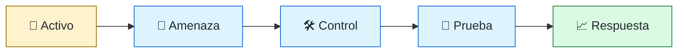
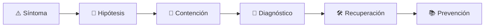

# 🔐 Security Engineer
<!-- role-visual:start -->

**La guía conecta trabajo real, decisiones, clases concretas y evidencia defendible.**

<!-- role-visual:end -->

> Integra prevención, detección y recuperación en productos y plataformas sin convertir
> seguridad en una revisión tardía o una lista de herramientas.
>
> **Entrada habitual:** semi-senior/senior · **Foco:** secure design, AppSec y supply
> chain · **Evidencia central:** riesgo trazado a controles y pruebas negativas

## 🧭 Qué es y por qué importa

Security engineering aplica ingeniería al riesgo deliberado: abuso, compromiso de
dependencias, escalada de privilegios, fuga de datos y manipulación del ciclo de entrega.
Trabaja con desarrollo y plataforma para que el camino seguro sea viable. No elimina
todo riesgo; lo hace visible, reduce exposición y prepara respuesta.

## 🗓️ Un día en el puesto

- modelar amenazas de una función o arquitectura;
- revisar autenticación, autorización y límites de confianza;
- investigar un hallazgo SAST/SCA sin aceptar falsos positivos a ciegas;
- diseñar una prueba negativa o control preventivo;
- mejorar secretos, IAM o procedencia de artefactos;
- coordinar remediación y evidencia con ingeniería y compliance.

## ✅ Responsabilidades y límites

- Responde por asesoría accionable y mecanismos verificables.
- Diferencia riesgo, vulnerabilidad, exploitabilidad e impacto.
- No usa el escáner como oráculo ni bloquea sin explicar amenaza.
- No promete cumplimiento solo porque existe un control.
- No reemplaza pentesting especializado ni respuesta forense cuando se requieren.

## 🧠 Qué necesitas saber

- redes, sistemas, web, APIs, datos e identidad;
- threat modeling, secure design y least privilege;
- OWASP, NIST SSDF, SAST, DAST, SCA y fuzzing;
- secretos, IAM, containers, cloud y seguridad de pipelines;
- SBOM, firma, provenance, SLSA y riesgos de paquetes;
- respuesta a incidentes, privacidad y evidencia de cumplimiento.

## 📚 Tu ruta en el programa

1. Partes 02–03, 05 y 09 para sistemas, red, programación y dependencias.
2. Partes 12–14 para requisitos, contratos, privacidad y experiencia.
3. Partes 20, 22 y 29 para APIs, dispositivos y cloud.
4. Parte 30 para pruebas y [Parte 32 — Seguridad, privacidad y cumplimiento](../classes/part-32-seguridad-privacidad-y-cumplimiento/README.md).
5. Partes 33–35 para supply chain, pipeline, observabilidad e incidentes.
6. Partes 38–39 para riesgos de código y agentes generativos.

<!-- role-depth:start -->
## 🗺️ Sistema profesional del rol

El gráfico no representa una cascada rígida. Muestra el bucle profesional que este rol
debe poder recorrer: comprender el contexto, tomar una decisión, intervenir, observar
el efecto y convertir lo aprendido en una mejora. En **🔐 Security Engineer**, saltar directamente a
la herramienta suele ocultar el problema, mientras que terminar sin evidencia deja la
decisión en una opinión. La misión concreta es: Integra prevención, detección y recuperación en productos y plataformas sin convertir seguridad en una revisión tardía o una lista de herramientas. Cada transición
debe conservar supuestos, responsables y una forma de volver atrás.

<table>
<tr>
<td valign="top" width="50%">

### 🎯 Responde por

- decisiones propias de la familia **Seguridad**;
- el resultado observable, no sólo la actividad ejecutada;
- límites, riesgos, operación y deuda residual de su intervención;
- evidencia que otra persona pueda revisar o reproducir.

</td>
<td valign="top" width="50%">

### 🤝 Coordina con

- [⚖️ Compliance Engineer](compliance-engineer.md); [📦 Build & Release Engineer](build-release-engineer.md); [☁️ Cloud Engineer](cloud-engineer.md);
- producto y personas usuarias cuando cambia una tarea o outcome;
- seguridad, privacidad, accesibilidad y operación según el riesgo;
- quienes mantendrán el sistema después de la entrega.

</td>
</tr>
</table>

El título no concede autoridad automática. El alcance real depende del equipo, la
industria y la criticidad. Esta guía describe un recorrido desde **semi-senior → principal**, pero una
vacante se evalúa por las decisiones que permite tomar, los sistemas que pone bajo
responsabilidad y la evidencia exigida, no por el nombre del cargo.

## 🧱 Partes y clases asociadas

La ruta distingue **parte** —unidad curricular con una capacidad acumulativa— de
**clase asociada** —punto concreto donde se estudia un mecanismo o una decisión. Las
clases siguientes forman el núcleo; no eliminan los prerrequisitos indicados en sus
propias páginas ni convierten en opcional la base común.

| Orden | Parte del programa | Clases clave | Por qué entra en esta ruta | Evidencia de transferencia |
| ---: | --- | --- | --- | --- |
| 1 | [Parte 20 · Backend, APIs y procesamiento asíncrono](../classes/part-20-backend-apis-y-procesamiento-asincrono/README.md) | [SE-245 · Autenticación, autorización y contexto](../classes/part-20-backend-apis-y-procesamiento-asincrono/se-245-autenticacion-autorizacion-y-contexto/README.md) [SE-249 · Caching, rate limiting y protección](../classes/part-20-backend-apis-y-procesamiento-asincrono/se-249-caching-rate-limiting-y-proteccion/README.md) [SE-251 · Taller: reparar una API insegura e inconsistente](../classes/part-20-backend-apis-y-procesamiento-asincrono/se-251-taller-reparar-una-api-insegura-e-inconsistente/README.md) | Profundiza **servicios, APIs y procesamiento asíncrono** desde la responsabilidad del rol. | Servicio contractual operable. |
| 2 | [Parte 32 · Seguridad, privacidad y cumplimiento](../classes/part-32-seguridad-privacidad-y-cumplimiento/README.md) | [SE-385 · Principios de seguridad y modelos de amenaza](../classes/part-32-seguridad-privacidad-y-cumplimiento/se-385-principios-de-seguridad-y-modelos-de-amenaza/README.md) [SE-387 · Autorización, recursos y mínimo privilegio](../classes/part-32-seguridad-privacidad-y-cumplimiento/se-387-autorizacion-recursos-y-minimo-privilegio/README.md) [SE-392 · Secure SDLC, abuso y pruebas negativas](../classes/part-32-seguridad-privacidad-y-cumplimiento/se-392-secure-sdlc-abuso-y-pruebas-negativas/README.md) | Profundiza **seguridad, privacidad y cumplimiento** desde la responsabilidad del rol. | Controles con pruebas y evidencia. |
| 3 | [Parte 33 · Build, release y cadena de suministro](../classes/part-33-build-release-y-cadena-de-suministro/README.md) | [SE-399 · Dependencias directas, transitivas y vendorización](../classes/part-33-build-release-y-cadena-de-suministro/se-399-dependencias-directas-transitivas-y-vendorizacion/README.md) [SE-400 · SBOM, procedencia y atestaciones](../classes/part-33-build-release-y-cadena-de-suministro/se-400-sbom-procedencia-y-atestaciones/README.md) [SE-406 · Riesgos de CI y dependencias comprometidas](../classes/part-33-build-release-y-cadena-de-suministro/se-406-riesgos-de-ci-y-dependencias-comprometidas/README.md) | Profundiza **build, release y cadena de suministro** desde la responsabilidad del rol. | Release firmado y verificable. |
| 4 | [Parte 35 · Observabilidad, SRE e incidentes](../classes/part-35-observabilidad-sre-e-incidentes/README.md) | [SE-422 · Logs estructurados y correlación](../classes/part-35-observabilidad-sre-e-incidentes/se-422-logs-estructurados-y-correlacion/README.md) [SE-428 · Gestión de incidentes y comunicación](../classes/part-35-observabilidad-sre-e-incidentes/se-428-gestion-de-incidentes-y-comunicacion/README.md) [SE-430 · Continuidad, disaster recovery y ejercicios](../classes/part-35-observabilidad-sre-e-incidentes/se-430-continuidad-disaster-recovery-y-ejercicios/README.md) | Profundiza **observabilidad, SRE e incidentes** desde la responsabilidad del rol. | Incidente diagnosticado y recuperado. |

**Cómo recorrerla.** Empieza por [SE-245](../classes/part-20-backend-apis-y-procesamiento-asincrono/se-245-autenticacion-autorizacion-y-contexto/README.md) para fijar el
primer mecanismo, usa [SE-399](../classes/part-33-build-release-y-cadena-de-suministro/se-399-dependencias-directas-transitivas-y-vendorizacion/README.md) para integrar el
centro de la especialidad y llega a [SE-430](../classes/part-35-observabilidad-sre-e-incidentes/se-430-continuidad-disaster-recovery-y-ejercicios/README.md) cuando ya
puedas explicar cómo detectar y recuperar un fallo. Una clase se considera estudiada
sólo cuando su concepto cambia una decisión y deja evidencia; abrir todos los enlaces
no constituye competencia.

> [!IMPORTANT]
> El mapa expresa el currículo previsto. La Parte 00 está desarrollada; las partes
> posteriores conservan borradores o estructuras que deben superar revisión
> cualitativa. Esta ruta no declara terminadas esas clases ni reemplaza el
> [roadmap](../ROADMAP.md).

## ⚖️ Decisiones y trade-offs que debes defender

| Decisión recurrente | Criterio profesional | Evidencia mínima antes de defenderla |
| --- | --- | --- |
| **Prevenir o detectar** | Combinar controles según coste evasión y recuperación. | Prueba negativa más señal operativa. |
| **Bloquear o advertir** | Graduar por explotabilidad impacto confianza y salida. | Falsos positivos y excepciones que caducan. |
| **Secreto o identidad federada** | Reducir material de larga vida y blast radius. | Sesión efímera con mínimo privilegio. |

La calidad de una decisión no se juzga porque coincida con una herramienta popular.
Debe hacer explícitos contexto, restricciones, alternativas descartadas, coste de
cambio y condición de revisión. En especial, **Prevenir o detectar**, **Bloquear o advertir**
y **Secreto o identidad federada** cambian de respuesta cuando cambia el riesgo. Una solución
correcta en un prototipo puede ser irresponsable en un sistema regulado; una solución
robusta para un servicio crítico puede ser desperdicio en una herramienta interna.

## 🚨 Escenario profesional: Dependencia comprometida entra por un build legítimo

**Síntoma.** La firma confirma origen interno pero no integridad de la cadena previa. La respuesta madura evita convertir la primera
correlación en causa y conserva evidencia antes de modificar el sistema.

1. **Detectar y delimitar:** identifica quién o qué está afectado, desde cuándo y qué
   cambió. Conserva timestamps, versiones, entradas y señales suficientes para no
   destruir la escena al intentar arreglarla.
2. **Investigar:** Rastrear lockfile provenance builder SBOM permisos y consumidores. Formula al menos dos hipótesis rivales
   y define qué observación refutaría cada una.
3. **Contener:** reduce blast radius y daño sin prometer una corrección todavía. La
   contención debe ser reversible, visible y compatible con las obligaciones del
   sistema.
4. **Recuperar:** Aislar artefacto revocar credenciales identificar alcance reconstruir y comunicar. Verifica la tarea completa, no sólo que un
   proceso volvió a estar verde.
5. **Aprender:** añade una regresión, señal o control que detecte la misma clase de
   fallo. Documenta qué deuda permanece y quién revisará la acción.

El escenario evalúa método además de resultado. Una recuperación rápida que borra la
causa, oculta pérdida de datos o deja al equipo sin mecanismo preventivo no demuestra
dominio del rol.

## 📊 Señales útiles y límites de las métricas

| Señal | Qué ayuda a observar | Trampa que debe evitarse |
| --- | --- | --- |
| **Riesgo residual por amenaza** | Exposición después de controles y supuestos. | Contar vulnerabilidades sin contexto. |
| **Tiempo de contención** | Capacidad de revocar aislar y limitar daño. | Cerrar ticket sin verificar alcance. |
| **Cobertura de controles probados** | Defensas que realmente detectan o impiden abuso. | Contar herramientas instaladas. |

Ninguna señal debe convertirse en ranking individual. Combina tendencia cuantitativa,
muestreo de casos, feedback cualitativo y contexto de carga. Declara ventana,
denominador, fuente, exclusiones y quién puede actuar sobre el resultado. Si una
métrica mejora mientras el outcome o el riesgo empeoran, el sistema está optimizando
el indicador y no el trabajo.

## 🧩 Proyecto integrador del rol: Producto con seguridad verificable

**Propósito:** conectar amenazas con controles pruebas telemetría y respuesta. El resultado esperado es **threat model requisitos controles negativos SBOM procedencia dashboard runbook y riesgo aceptado**.

Entrega un expediente revisable con estas piezas:

1. **Contexto y alcance:** usuario, sistema, restricción, supuestos, fuera de alcance y
   criterio de no éxito.
2. **Decisión:** al menos dos alternativas reales, trade-offs, coste de reversión y un
   ADR o memo que indique cuándo revisar la elección.
3. **Artefacto principal:** una implementación, modelo, flujo o política coherente con
   las clases núcleo; no una captura aislada ni una presentación sin mecanismo.
4. **Fallo controlado:** introduce una condición adversa relacionada con el escenario
   anterior y conserva el resultado observado, sin inventar una ejecución.
5. **Verificación:** prueba, rúbrica, revisión o medición que pueda fallar y que conecte
   directamente con el resultado profesional.
6. **Operación y salida:** telemetría, recuperación, mantenimiento, deprecación o retiro
   según corresponda; incluye límites y deuda residual.

**Criterio de aceptación:** otra persona puede reconstruir el razonamiento, reproducir
la comprobación y distinguir claramente qué quedó demostrado de lo que sólo se propone.
El proyecto no se aprueba por cantidad de archivos ni por utilizar una marca concreta.

## 📈 Dominio esperado por alcance

| Alcance | Qué resuelve | Qué evidencia su autonomía |
| --- | --- | --- |
| **Inicial** | ejecuta una tarea acotada con criterios y acompañamiento | reproduce el caso, pregunta por supuestos y entrega evidencia legible |
| **Intermedio** | decide dentro de un componente o flujo conocido | compara alternativas, prueba fallos previsibles y coordina dependencias |
| **Senior** | conduce problemas ambiguos que cruzan sistemas o equipos | hace explícito el riesgo, diseña recuperación y mejora el mecanismo de trabajo |
| **Staff / Lead** | cambia capacidades compartidas y decisiones de largo plazo | multiplica criterio, define guardrails, mide adopción y conserva opciones futuras |

Progresar no significa alejarse de la práctica. Significa aumentar ambigüedad, horizonte,
blast radius y responsabilidad por consecuencias. La persona senior todavía debe poder
explicar el mecanismo; la persona Staff además crea condiciones para que otros lo
operen sin depender de ella.

## 🗓️ Plan de práctica 30 · 60 · 90 días

- **Días 1–30 — comprender y reproducir.** Estudia las primeras clases de cada parte,
  reproduce un caso pequeño y escribe un mapa de responsabilidades. El entregable es
  una baseline con preguntas abiertas, no una transformación prematura.
- **Días 31–60 — intervenir y fallar con control.** Construye el artefacto central,
  introduce el escenario de fallo y mide el comportamiento. Revisa el trabajo con una
  persona de una ruta vecina para descubrir supuestos de frontera.
- **Días 61–90 — operar y transferir.** Ejecuta recuperación, corrige la causa, publica
  runbook o guía de uso y presenta la decisión con trade-offs. Termina con una
  retrospectiva que separe resultado, evidencia, límites y siguiente inversión.

Este plan es una secuencia de práctica, no una promesa de empleabilidad en noventa días.
La experiencia previa, el dominio y el acceso a sistemas reales cambian el tiempo
necesario.

## 🎤 Preguntas para revisión o entrevista

1. ¿En qué contexto elegirías **Prevenir o detectar** y qué evidencia te haría cambiar?
2. ¿Cómo distinguirías síntoma, causa y daño en el escenario **Dependencia comprometida entra por un build legítimo**?
3. ¿Qué clase asociada usarías para diseñar el mecanismo y cuál para verificarlo?
4. ¿Qué parte de **Producto con seguridad verificable** no automatizarías todavía y por qué?
5. ¿Qué métrica podría mejorar mientras el sistema empeora y qué guardrail añadirías?
6. ¿Dónde termina la autoridad de este rol y cuándo debe escalar o pedir revisión?

Una respuesta fuerte usa un caso, reconoce incertidumbre y propone una comprobación.
Nombrar una herramienta sin explicar mecanismo, fallo y límite no demuestra la
competencia.

## 🔗 Fuentes primarias y oficiales

- [Secure Software Development Framework SP 800-218](https://csrc.nist.gov/pubs/sp/800/218/final) — **NIST**. Se usa como referencia primaria u oficial; la guía no sustituye la fuente.
- [SLSA specification v1.2](https://slsa.dev/spec/v1.2/) — **OpenSSF**. Se usa como referencia primaria u oficial; la guía no sustituye la fuente.
- [ACM Code of Ethics and Professional Conduct](https://www.acm.org/code-of-ethics) — **ACM**. Se usa como referencia primaria u oficial; la guía no sustituye la fuente.

Las fuentes orientan principios, vocabulario y prácticas; no convierten la guía en una
certificación ni sustituyen la documentación específica del sistema, la jurisdicción
o la tecnología utilizada.
<!-- role-depth:end -->

## 🧪 Evidencia de portafolio

- threat model con activos, límites, amenazas y decisiones;
- autorización probada con casos de abuso;
- pipeline con SAST/SCA/secret scanning y triaje documentado;
- SBOM, firma y procedencia verificadas;
- cadena regulación → requisito → control → prueba → evidencia;
- tabletop o incidente simulado con contención y aprendizaje.

## 📈 Progresión

Software/Infrastructure Engineer → Security Engineer → Senior → Staff/Product
Security, AppSec, Cloud Security o Security Architecture. La progresión aumenta el
alcance de los sistemas protegidos y la capacidad de influir sin crear cuellos de botella.

## ⚠️ Mitos frecuentes

- “Más escáneres significa más seguridad.” Sin triaje generan ruido y bypass.
- “Cumplir equivale a ser seguro.” Compliance define evidencia mínima, no ausencia de riesgo.
- “Shift-left significa mover todo a desarrollo.” También hay runtime y respuesta.
- “La IA arregla vulnerabilidades automáticamente.” También introduce APIs falsas y código inseguro.

## 🚀 Siguientes pasos

1. Modela amenazas de un flujo real antes de elegir herramientas.
2. Implementa un control y una prueba que demuestre su límite.
3. Introduce una dependencia comprometida en un laboratorio controlado.
4. Practica comunicación de riesgo con una recomendación priorizada.

---

[⬅️ Volver a las rutas](README.md) · [🏠 Inicio del programa](../README.md)
