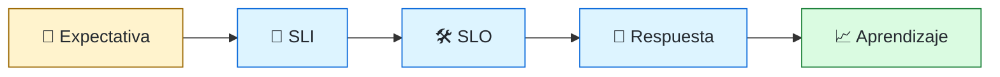
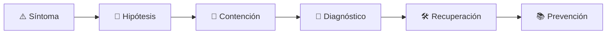

# 📈 Site Reliability Engineer
<!-- role-visual:start -->

**La guía conecta trabajo real, decisiones, clases concretas y evidencia defendible.**

<!-- role-visual:end -->

> Aplica ingeniería de software a la confiabilidad: convierte expectativas de servicio
> en señales, automatización, límites de riesgo y aprendizaje operativo.
>
> **Entrada habitual:** semi-senior/senior · **Foco:** SLO, capacidad e incidentes ·
> **Evidencia central:** servicio que detecta, degrada y recupera de forma ensayada

## 🧭 Qué es y por qué importa

SRE gestiona la tensión entre velocidad de cambio y confiabilidad mediante objetivos
explícitos. Define SLI/SLO, usa error budgets, reduce toil con software y aprende de
incidentes sin buscar culpables. No promete disponibilidad infinita: acuerda qué nivel
de servicio importa y qué inversión lo sostiene.

## 🗓️ Un día en el puesto

- revisar alertas y distinguir síntoma accionable de ruido;
- analizar capacidad, saturación y tendencias;
- automatizar una operación manual repetitiva;
- participar en guardia, contención o postmortem;
- ajustar SLO con producto y equipos de servicio;
- ejecutar un game day o validar recuperación de backup.

## ✅ Responsabilidades y límites

- Responde por mecanismos y feedback de confiabilidad, no por absorber todo incidente.
- Comparte guardia y aprendizaje con quienes construyen el servicio.
- No convierte cada métrica en alerta.
- No usa error budgets como castigo ni SLO como SLA contractual sin acuerdo.
- No automatiza una operación que todavía no comprende.

## 🧠 Qué necesitas saber

- sistemas operativos, redes, concurrencia y sistemas distribuidos;
- latencia, throughput, percentiles y capacity planning;
- logs, métricas, trazas, profiling y OpenTelemetry;
- SLI, SLO, SLA, error budgets y toil;
- fault tolerance, backups, RTO/RPO y disaster recovery;
- incident command, runbooks, postmortems y chaos engineering.

## 📚 Tu ruta en el programa

1. Partes 02–03, 08 y 20 para sistemas, red, debugging y servicios.
2. Partes 26–29 para datos, eventos, distribución y cloud.
3. Parte 31 para rendimiento y resiliencia.
4. Parte 34 para entrega progresiva y rollback.
5. [Parte 35 — Observabilidad, SRE e incidentes](../classes/part-35-observabilidad-sre-e-incidentes/README.md).
6. Parte 36 para continuidad de sistemas legacy; partes 38–39 para agentes operativos controlados.

<!-- role-depth:start -->
## 🗺️ Sistema profesional del rol

El gráfico no representa una cascada rígida. Muestra el bucle profesional que este rol
debe poder recorrer: comprender el contexto, tomar una decisión, intervenir, observar
el efecto y convertir lo aprendido en una mejora. En **📈 Site Reliability Engineer**, saltar directamente a
la herramienta suele ocultar el problema, mientras que terminar sin evidencia deja la
decisión en una opinión. La misión concreta es: Aplica ingeniería de software a la confiabilidad: convierte expectativas de servicio en señales, automatización, límites de riesgo y aprendizaje operativo. Cada transición
debe conservar supuestos, responsables y una forma de volver atrás.

<table>
<tr>
<td valign="top" width="50%">

### 🎯 Responde por

- decisiones propias de la familia **Confiabilidad**;
- el resultado observable, no sólo la actividad ejecutada;
- límites, riesgos, operación y deuda residual de su intervención;
- evidencia que otra persona pueda revisar o reproducir.

</td>
<td valign="top" width="50%">

### 🤝 Coordina con

- [🔭 Observability Engineer](observability-engineer.md); [🚚 DevOps Engineer](devops-engineer.md); [🗄️ Database Reliability Engineer](database-reliability-engineer.md);
- producto y personas usuarias cuando cambia una tarea o outcome;
- seguridad, privacidad, accesibilidad y operación según el riesgo;
- quienes mantendrán el sistema después de la entrega.

</td>
</tr>
</table>

El título no concede autoridad automática. El alcance real depende del equipo, la
industria y la criticidad. Esta guía describe un recorrido desde **semi-senior → principal**, pero una
vacante se evalúa por las decisiones que permite tomar, los sistemas que pone bajo
responsabilidad y la evidencia exigida, no por el nombre del cargo.

## 🧱 Partes y clases asociadas

La ruta distingue **parte** —unidad curricular con una capacidad acumulativa— de
**clase asociada** —punto concreto donde se estudia un mecanismo o una decisión. Las
clases siguientes forman el núcleo; no eliminan los prerrequisitos indicados en sus
propias páginas ni convierten en opcional la base común.

| Orden | Parte del programa | Clases clave | Por qué entra en esta ruta | Evidencia de transferencia |
| ---: | --- | --- | --- | --- |
| 1 | [Parte 28 · Concurrencia y sistemas distribuidos](../classes/part-28-concurrencia-y-sistemas-distribuidos/README.md) | [SE-341 · Fallos parciales y modelos de red](../classes/part-28-concurrencia-y-sistemas-distribuidos/se-341-fallos-parciales-y-modelos-de-red/README.md) [SE-342 · Consistencia, disponibilidad y particiones](../classes/part-28-concurrencia-y-sistemas-distribuidos/se-342-consistencia-disponibilidad-y-particiones/README.md) [SE-346 · Caos controlado y pruebas de distribución](../classes/part-28-concurrencia-y-sistemas-distribuidos/se-346-caos-controlado-y-pruebas-de-distribucion/README.md) | Profundiza **concurrencia, coordinación y fallos parciales** desde la responsabilidad del rol. | Experimento distribuido de degradación. |
| 2 | [Parte 31 · Calidad, rendimiento y resiliencia](../classes/part-31-calidad-rendimiento-y-resiliencia/README.md) | [SE-376 · Latencia, throughput, saturación y capacidad](../classes/part-31-calidad-rendimiento-y-resiliencia/se-376-latencia-throughput-saturacion-y-capacidad/README.md) [SE-378 · Timeouts, retries, backoff y jitter](../classes/part-31-calidad-rendimiento-y-resiliencia/se-378-timeouts-retries-backoff-y-jitter/README.md) [SE-380 · Disponibilidad, durabilidad y recuperación](../classes/part-31-calidad-rendimiento-y-resiliencia/se-380-disponibilidad-durabilidad-y-recuperacion/README.md) | Profundiza **calidad, rendimiento y resiliencia** desde la responsabilidad del rol. | Informe medido y game day. |
| 3 | [Parte 35 · Observabilidad, SRE e incidentes](../classes/part-35-observabilidad-sre-e-incidentes/README.md) | [SE-425 · SLI, SLO, SLA y presupuestos de error](../classes/part-35-observabilidad-sre-e-incidentes/se-425-sli-slo-sla-y-presupuestos-de-error/README.md) [SE-427 · Runbooks, on-call y escalamiento](../classes/part-35-observabilidad-sre-e-incidentes/se-427-runbooks-on-call-y-escalamiento/README.md) [SE-430 · Continuidad, disaster recovery y ejercicios](../classes/part-35-observabilidad-sre-e-incidentes/se-430-continuidad-disaster-recovery-y-ejercicios/README.md) | Profundiza **observabilidad, SRE e incidentes** desde la responsabilidad del rol. | Incidente diagnosticado y recuperado. |
| 4 | [Parte 36 · Mantenimiento y modernización legacy](../classes/part-36-mantenimiento-y-modernizacion-legacy/README.md) | [SE-433 · Mantenimiento correctivo, adaptativo y perfectivo](../classes/part-36-mantenimiento-y-modernizacion-legacy/se-433-mantenimiento-correctivo-adaptativo-y-perfectivo/README.md) [SE-436 · Dependencias obsoletas y riesgo acumulado](../classes/part-36-mantenimiento-y-modernizacion-legacy/se-436-dependencias-obsoletas-y-riesgo-acumulado/README.md) [SE-443 · Taller: estabilizar antes de modernizar](../classes/part-36-mantenimiento-y-modernizacion-legacy/se-443-taller-estabilizar-antes-de-modernizar/README.md) | Profundiza **mantenimiento, modernización y retiro** desde la responsabilidad del rol. | Migración incremental reversible. |

**Cómo recorrerla.** Empieza por [SE-341](../classes/part-28-concurrencia-y-sistemas-distribuidos/se-341-fallos-parciales-y-modelos-de-red/README.md) para fijar el
primer mecanismo, usa [SE-425](../classes/part-35-observabilidad-sre-e-incidentes/se-425-sli-slo-sla-y-presupuestos-de-error/README.md) para integrar el
centro de la especialidad y llega a [SE-443](../classes/part-36-mantenimiento-y-modernizacion-legacy/se-443-taller-estabilizar-antes-de-modernizar/README.md) cuando ya
puedas explicar cómo detectar y recuperar un fallo. Una clase se considera estudiada
sólo cuando su concepto cambia una decisión y deja evidencia; abrir todos los enlaces
no constituye competencia.

> [!IMPORTANT]
> El mapa expresa el currículo previsto. Las Partes 00–02 están desarrolladas; las
> posteriores conservan borradores o estructuras que deben superar revisión
> cualitativa. Esta ruta no declara terminadas esas clases ni reemplaza el
> [roadmap](../ROADMAP.md).

## ⚖️ Decisiones y trade-offs que debes defender

| Decisión recurrente | Criterio profesional | Evidencia mínima antes de defenderla |
| --- | --- | --- |
| **Confiabilidad o velocidad** | Usar error budget como señal de decisión compartida. | SLO y tendencia de consumo. |
| **Automatizar o documentar** | Automatizar toil entendido y conservar ruta manual segura. | Horas de toil y fallo de automatización. |
| **Redundancia o simplicidad** | Añadir copias sólo si reducen modos de fallo netos. | Game day y coste operativo. |

La calidad de una decisión no se juzga porque coincida con una herramienta popular.
Debe hacer explícitos contexto, restricciones, alternativas descartadas, coste de
cambio y condición de revisión. En especial, **Confiabilidad o velocidad**, **Automatizar o documentar**
y **Redundancia o simplicidad** cambian de respuesta cuando cambia el riesgo. Una solución
correcta en un prototipo puede ser irresponsable en un sistema regulado; una solución
robusta para un servicio crítico puede ser desperdicio en una herramienta interna.

## 🚨 Escenario profesional: Servicio responde pero incumple su tarea útil

**Síntoma.** Health checks pasan mientras una dependencia devuelve datos obsoletos. La respuesta madura evita convertir la primera
correlación en causa y conserva evidencia antes de modificar el sistema.

1. **Detectar y delimitar:** identifica quién o qué está afectado, desde cuándo y qué
   cambió. Conserva timestamps, versiones, entradas y señales suficientes para no
   destruir la escena al intentar arreglarla.
2. **Investigar:** Comparar SLI de usuario saturación trazas dependencia y despliegues. Formula al menos dos hipótesis rivales
   y define qué observación refutaría cada una.
3. **Contener:** reduce blast radius y daño sin prometer una corrección todavía. La
   contención debe ser reversible, visible y compatible con las obligaciones del
   sistema.
4. **Recuperar:** Degradar contener comunicar recuperar y revisar objetivo. Verifica la tarea completa, no sólo que un
   proceso volvió a estar verde.
5. **Aprender:** añade una regresión, señal o control que detecte la misma clase de
   fallo. Documenta qué deuda permanece y quién revisará la acción.

El escenario evalúa método además de resultado. Una recuperación rápida que borra la
causa, oculta pérdida de datos o deja al equipo sin mecanismo preventivo no demuestra
dominio del rol.

## 📊 Señales útiles y límites de las métricas

| Señal | Qué ayuda a observar | Trampa que debe evitarse |
| --- | --- | --- |
| **Cumplimiento de SLO** | Experiencia buena medida sobre ventana acordada. | Usar uptime de proceso como servicio. |
| **Consumo de error budget** | Ritmo y concentración del riesgo. | Convertirlo en castigo al equipo. |
| **Toil por guardia** | Trabajo manual repetitivo y automatizable. | Automatizar sin medir demanda. |

Ninguna señal debe convertirse en ranking individual. Combina tendencia cuantitativa,
muestreo de casos, feedback cualitativo y contexto de carga. Declara ventana,
denominador, fuente, exclusiones y quién puede actuar sobre el resultado. Si una
métrica mejora mientras el outcome o el riesgo empeoran, el sistema está optimizando
el indicador y no el trabajo.

## 🧩 Proyecto integrador del rol: Servicio con confiabilidad ensayada

**Propósito:** definir SLO observar degradación y recuperar una falla compuesta. El resultado esperado es **SLI dashboard alertas runbook game day timeline postmortem y backlog priorizado**.

Entrega un expediente revisable con estas piezas:

1. **Contexto y alcance:** usuario, sistema, restricción, supuestos, fuera de alcance y
   criterio de no éxito.
2. **Decisión:** al menos dos alternativas reales, trade-offs, coste de reversión y un
   ADR o memo que indique cuándo revisar la elección.
3. **Artefacto principal:** una implementación, modelo, flujo o política coherente con
   las clases núcleo; no una captura aislada ni una presentación sin mecanismo.
4. **Fallo controlado:** introduce una condición adversa relacionada con el escenario
   anterior y conserva el resultado observado, sin inventar una ejecución.
5. **Verificación:** prueba, rúbrica, revisión o medición que pueda fallar y que conecte
   directamente con el resultado profesional.
6. **Operación y salida:** telemetría, recuperación, mantenimiento, deprecación o retiro
   según corresponda; incluye límites y deuda residual.

**Criterio de aceptación:** otra persona puede reconstruir el razonamiento, reproducir
la comprobación y distinguir claramente qué quedó demostrado de lo que sólo se propone.
El proyecto no se aprueba por cantidad de archivos ni por utilizar una marca concreta.

## 📈 Dominio esperado por alcance

| Alcance | Qué resuelve | Qué evidencia su autonomía |
| --- | --- | --- |
| **Inicial** | ejecuta una tarea acotada con criterios y acompañamiento | reproduce el caso, pregunta por supuestos y entrega evidencia legible |
| **Intermedio** | decide dentro de un componente o flujo conocido | compara alternativas, prueba fallos previsibles y coordina dependencias |
| **Senior** | conduce problemas ambiguos que cruzan sistemas o equipos | hace explícito el riesgo, diseña recuperación y mejora el mecanismo de trabajo |
| **Staff / Lead** | cambia capacidades compartidas y decisiones de largo plazo | multiplica criterio, define guardrails, mide adopción y conserva opciones futuras |

Progresar no significa alejarse de la práctica. Significa aumentar ambigüedad, horizonte,
blast radius y responsabilidad por consecuencias. La persona senior todavía debe poder
explicar el mecanismo; la persona Staff además crea condiciones para que otros lo
operen sin depender de ella.

## 🗓️ Plan de práctica 30 · 60 · 90 días

- **Días 1–30 — comprender y reproducir.** Estudia las primeras clases de cada parte,
  reproduce un caso pequeño y escribe un mapa de responsabilidades. El entregable es
  una baseline con preguntas abiertas, no una transformación prematura.
- **Días 31–60 — intervenir y fallar con control.** Construye el artefacto central,
  introduce el escenario de fallo y mide el comportamiento. Revisa el trabajo con una
  persona de una ruta vecina para descubrir supuestos de frontera.
- **Días 61–90 — operar y transferir.** Ejecuta recuperación, corrige la causa, publica
  runbook o guía de uso y presenta la decisión con trade-offs. Termina con una
  retrospectiva que separe resultado, evidencia, límites y siguiente inversión.

Este plan es una secuencia de práctica, no una promesa de empleabilidad en noventa días.
La experiencia previa, el dominio y el acceso a sistemas reales cambian el tiempo
necesario.

## 🎤 Preguntas para revisión o entrevista

1. ¿En qué contexto elegirías **Confiabilidad o velocidad** y qué evidencia te haría cambiar?
2. ¿Cómo distinguirías síntoma, causa y daño en el escenario **Servicio responde pero incumple su tarea útil**?
3. ¿Qué clase asociada usarías para diseñar el mecanismo y cuál para verificarlo?
4. ¿Qué parte de **Servicio con confiabilidad ensayada** no automatizarías todavía y por qué?
5. ¿Qué métrica podría mejorar mientras el sistema empeora y qué guardrail añadirías?
6. ¿Dónde termina la autoridad de este rol y cuándo debe escalar o pedir revisión?

Una respuesta fuerte usa un caso, reconoce incertidumbre y propone una comprobación.
Nombrar una herramienta sin explicar mecanismo, fallo y límite no demuestra la
competencia.

## 🔗 Fuentes primarias y oficiales

- [Site Reliability Engineering](https://sre.google/books/) — **Google**. Se usa como referencia primaria u oficial; la guía no sustituye la fuente.
- [OpenTelemetry Documentation](https://opentelemetry.io/docs/) — **CNCF / OpenTelemetry**. Se usa como referencia primaria u oficial; la guía no sustituye la fuente.
- [DORA software delivery performance metrics](https://dora.dev/guides/dora-metrics/) — **Google Cloud**. Se usa como referencia primaria u oficial; la guía no sustituye la fuente.

Las fuentes orientan principios, vocabulario y prácticas; no convierten la guía en una
certificación ni sustituyen la documentación específica del sistema, la jurisdicción
o la tecnología utilizada.
<!-- role-depth:end -->

## 🧪 Evidencia de portafolio

- SLO derivado de una experiencia de usuario y SLI implementado;
- alertas por síntomas con runbook y prueba de escalado;
- dashboard que diferencia tráfico, errores, latencia y saturación;
- load/soak test con capacidad y límites declarados;
- restore ensayado con RTO/RPO observado;
- postmortem con timeline, factores contribuyentes y acciones verificables.

## 📈 Progresión

Software/Systems Engineer → SRE → Senior SRE → Staff Reliability / SRE Lead. También
puede transitar a plataforma, arquitectura distribuida o liderazgo de infraestructura.
La progresión reduce riesgo sistémico más allá de un servicio.

## ⚠️ Mitos frecuentes

- “SRE es operaciones con otro nombre.” Requiere ingeniería y objetivos explícitos.
- “Cinco nueves es siempre mejor.” Puede costar más que el valor que protege.
- “No hubo incidentes, somos confiables.” Quizá faltan tráfico o detección.
- “El postmortem sin culpa no tiene responsables.” Sí tiene ownership, sin simplificar causas.

## 🚀 Siguientes pasos

1. Define un SLO pequeño a partir de un recorrido de usuario.
2. Instrumenta la señal y prueba que detecta degradación.
3. Satura una dependencia en un entorno controlado.
4. Recupera, escribe el postmortem y verifica las acciones posteriores.

---

[⬅️ Volver a las rutas](README.md) · [🏠 Inicio del programa](../README.md)
