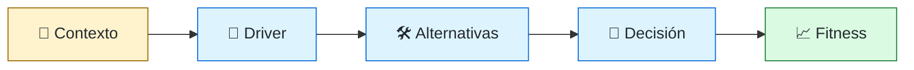
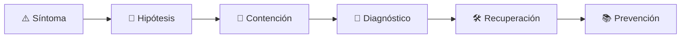

# 🏛️ Software Architect
<!-- role-visual:start -->

**La guía conecta trabajo real, decisiones, clases concretas y evidencia defendible.**

<!-- role-visual:end -->

> Alinea contexto, restricciones, atributos de calidad y evolución; hace explícitas
> decisiones difíciles sin convertirse en una autoridad separada de la implementación.
>
> **Entrada habitual:** senior/staff · **Foco:** límites y decisiones sistémicas ·
> **Evidencia central:** arquitectura defendible que sobrevive al contacto con operación

## 🧭 Qué es y por qué importa

La arquitectura son decisiones de alto impacto y alto coste de cambio. El rol ayuda a
formular el problema, comparar alternativas y mantener coherencia entre equipos. Puede
ser una responsabilidad distribuida o un cargo formal. En ambos casos, la credibilidad
depende de conectar diagramas con código, datos, despliegue y consecuencias.

## 🗓️ Un día en el puesto

- facilitar discovery de atributos de calidad y restricciones;
- revisar un ADR/RFC y tensionar supuestos;
- modelar límites, flujos de datos y escenarios de fallo;
- acompañar un spike o implementación para validar una hipótesis;
- coordinar evolución entre equipos y contratos;
- revisar costes, riesgos, observabilidad y estrategia de migración.

## ✅ Responsabilidades y límites

- Responde por la calidad de la decisión y su trazabilidad, no por dibujar cajas.
- Mantiene opciones reversibles cuando la evidencia es insuficiente.
- No prescribe tecnología sin contexto ni benchmark pertinente.
- No centraliza cada decisión ni bloquea a los equipos.
- No desaparece después del diseño: verifica comportamiento en producción.

## 🧠 Qué necesitas saber

- requisitos y atributos de calidad;
- modularidad, DDD, integración, datos y sistemas distribuidos;
- estilos arquitectónicos y sus costes operacionales;
- seguridad, privacidad, resiliencia, rendimiento y compliance;
- economía, build-vs-buy, FinOps y evolución legacy;
- facilitación, negociación, comunicación visual y escritura de ADR/RFC.

## 📚 Tu ruta en el programa

1. Partes 00 y 10–17 para profesión, producto, requisitos y decisiones.
2. Partes 20 y 23 para servicios y restricciones de dominio.
3. Parte 24 y [Parte 25 — Arquitectura de software y dominio](../classes/part-25-arquitectura-de-software-y-dominio/README.md), seguidas por datos, eventos, distribución y cloud.
4. Partes 30–35 para calidad, seguridad, entrega y operación.
5. Partes 36–37 para evolución y arquitectura sociotécnica.
6. Partes 38–39 para revisar arquitectura y agentes sin delegar criterio.

<!-- role-depth:start -->
## 🗺️ Sistema profesional del rol

El gráfico no representa una cascada rígida. Muestra el bucle profesional que este rol
debe poder recorrer: comprender el contexto, tomar una decisión, intervenir, observar
el efecto y convertir lo aprendido en una mejora. En **🏛️ Software Architect**, saltar directamente a
la herramienta suele ocultar el problema, mientras que terminar sin evidencia deja la
decisión en una opinión. La misión concreta es: Alinea contexto, restricciones, atributos de calidad y evolución; hace explícitas decisiones difíciles sin convertirse en una autoridad separada de la implementación. Cada transición
debe conservar supuestos, responsables y una forma de volver atrás.

<table>
<tr>
<td valign="top" width="50%">

### 🎯 Responde por

- decisiones propias de la familia **Diseño sistémico**;
- el resultado observable, no sólo la actividad ejecutada;
- límites, riesgos, operación y deuda residual de su intervención;
- evidencia que otra persona pueda revisar o reproducir.

</td>
<td valign="top" width="50%">

### 🤝 Coordina con

- [🧩 Solutions Architect](solutions-architect.md); [🧭 Staff / Principal Engineer y Technical Lead](technical-leadership.md); [🏚️ Legacy Modernization Engineer](legacy-modernization-engineer.md);
- producto y personas usuarias cuando cambia una tarea o outcome;
- seguridad, privacidad, accesibilidad y operación según el riesgo;
- quienes mantendrán el sistema después de la entrega.

</td>
</tr>
</table>

El título no concede autoridad automática. El alcance real depende del equipo, la
industria y la criticidad. Esta guía describe un recorrido desde **senior → principal**, pero una
vacante se evalúa por las decisiones que permite tomar, los sistemas que pone bajo
responsabilidad y la evidencia exigida, no por el nombre del cargo.

## 🧱 Partes y clases asociadas

La ruta distingue **parte** —unidad curricular con una capacidad acumulativa— de
**clase asociada** —punto concreto donde se estudia un mecanismo o una decisión. Las
clases siguientes forman el núcleo; no eliminan los prerrequisitos indicados en sus
propias páginas ni convierten en opcional la base común.

| Orden | Parte del programa | Clases clave | Por qué entra en esta ruta | Evidencia de transferencia |
| ---: | --- | --- | --- | --- |
| 1 | [Parte 12 · Ingeniería de requisitos](../classes/part-12-ingenieria-de-requisitos/README.md) | [SE-147 · Atributos de calidad y restricciones](../classes/part-12-ingenieria-de-requisitos/se-147-atributos-de-calidad-y-restricciones/README.md) [SE-151 · Trazabilidad desde necesidad hasta evidencia](../classes/part-12-ingenieria-de-requisitos/se-151-trazabilidad-desde-necesidad-hasta-evidencia/README.md) [SE-154 · Ambigüedad, contradicción e incompletitud](../classes/part-12-ingenieria-de-requisitos/se-154-ambiguedad-contradiccion-e-incompletitud/README.md) | Profundiza **requisitos, restricciones y trazabilidad** desde la responsabilidad del rol. | Baseline de requisitos revisable. |
| 2 | [Parte 25 · Arquitectura de software y dominio](../classes/part-25-arquitectura-de-software-y-dominio/README.md) | [SE-301 · Drivers, restricciones y atributos de arquitectura](../classes/part-25-arquitectura-de-software-y-dominio/se-301-drivers-restricciones-y-atributos-de-arquitectura/README.md) [SE-303 · Monolito, modular monolith y servicios](../classes/part-25-arquitectura-de-software-y-dominio/se-303-monolito-modular-monolith-y-servicios/README.md) [SE-309 · Trade-offs, ADR y evaluación de alternativas](../classes/part-25-arquitectura-de-software-y-dominio/se-309-trade-offs-adr-y-evaluacion-de-alternativas/README.md) | Profundiza **arquitectura, dominio y atributos de calidad** desde la responsabilidad del rol. | Arquitectura defendible con ADR. |
| 3 | [Parte 28 · Concurrencia y sistemas distribuidos](../classes/part-28-concurrencia-y-sistemas-distribuidos/README.md) | [SE-341 · Fallos parciales y modelos de red](../classes/part-28-concurrencia-y-sistemas-distribuidos/se-341-fallos-parciales-y-modelos-de-red/README.md) [SE-342 · Consistencia, disponibilidad y particiones](../classes/part-28-concurrencia-y-sistemas-distribuidos/se-342-consistencia-disponibilidad-y-particiones/README.md) [SE-346 · Caos controlado y pruebas de distribución](../classes/part-28-concurrencia-y-sistemas-distribuidos/se-346-caos-controlado-y-pruebas-de-distribucion/README.md) | Profundiza **concurrencia, coordinación y fallos parciales** desde la responsabilidad del rol. | Experimento distribuido de degradación. |
| 4 | [Parte 37 · Gestión, liderazgo y práctica profesional](../classes/part-37-gestion-liderazgo-y-practica-profesional/README.md) | [SE-446 · Diseño de equipos y ownership](../classes/part-37-gestion-liderazgo-y-practica-profesional/se-446-diseno-de-equipos-y-ownership/README.md) [SE-450 · Gestión de riesgos y decisiones ejecutivas](../classes/part-37-gestion-liderazgo-y-practica-profesional/se-450-gestion-de-riesgos-y-decisiones-ejecutivas/README.md) [SE-455 · Taller: conducir una revisión de decisión difícil](../classes/part-37-gestion-liderazgo-y-practica-profesional/se-455-taller-conducir-una-revision-de-decision-dificil/README.md) | Profundiza **liderazgo, organización y decisiones** desde la responsabilidad del rol. | Propuesta defendida ante conflicto. |

**Cómo recorrerla.** Empieza por [SE-147](../classes/part-12-ingenieria-de-requisitos/se-147-atributos-de-calidad-y-restricciones/README.md) para fijar el
primer mecanismo, usa [SE-341](../classes/part-28-concurrencia-y-sistemas-distribuidos/se-341-fallos-parciales-y-modelos-de-red/README.md) para integrar el
centro de la especialidad y llega a [SE-455](../classes/part-37-gestion-liderazgo-y-practica-profesional/se-455-taller-conducir-una-revision-de-decision-dificil/README.md) cuando ya
puedas explicar cómo detectar y recuperar un fallo. Una clase se considera estudiada
sólo cuando su concepto cambia una decisión y deja evidencia; abrir todos los enlaces
no constituye competencia.

> [!IMPORTANT]
> El mapa expresa el currículo previsto. La Parte 00 está desarrollada; las partes
> posteriores conservan borradores o estructuras que deben superar revisión
> cualitativa. Esta ruta no declara terminadas esas clases ni reemplaza el
> [roadmap](../ROADMAP.md).

## ⚖️ Decisiones y trade-offs que debes defender

| Decisión recurrente | Criterio profesional | Evidencia mínima antes de defenderla |
| --- | --- | --- |
| **Modular monolith o microservicios** | Derivar límites de autonomía escala y fallo no de organigrama ideal. | Escenarios de calidad y coste operacional. |
| **Consistencia o disponibilidad** | Asignar garantías por flujo y daño de divergencia. | Modelo de fallos más experimento. |
| **Estándar o excepción** | Crear coherencia donde reduce coste y salida donde el contexto difiere. | Fitness functions y revisión periódica. |

La calidad de una decisión no se juzga porque coincida con una herramienta popular.
Debe hacer explícitos contexto, restricciones, alternativas descartadas, coste de
cambio y condición de revisión. En especial, **Modular monolith o microservicios**, **Consistencia o disponibilidad**
y **Estándar o excepción** cambian de respuesta cuando cambia el riesgo. Una solución
correcta en un prototipo puede ser irresponsable en un sistema regulado; una solución
robusta para un servicio crítico puede ser desperdicio en una herramienta interna.

## 🚨 Escenario profesional: Un servicio crítico se degrada por una dependencia aparentemente auxiliar

**Síntoma.** El diagrama estático no representa runtime colas timeouts ni ownership. La respuesta madura evita convertir la primera
correlación en causa y conserva evidencia antes de modificar el sistema.

1. **Detectar y delimitar:** identifica quién o qué está afectado, desde cuándo y qué
   cambió. Conserva timestamps, versiones, entradas y señales suficientes para no
   destruir la escena al intentar arreglarla.
2. **Investigar:** Reconstruir vistas trazas contratos despliegue y escenarios de calidad. Formula al menos dos hipótesis rivales
   y define qué observación refutaría cada una.
3. **Contener:** reduce blast radius y daño sin prometer una corrección todavía. La
   contención debe ser reversible, visible y compatible con las obligaciones del
   sistema.
4. **Recuperar:** Contener rediseñar límite y registrar decisión con condición de revisión. Verifica la tarea completa, no sólo que un
   proceso volvió a estar verde.
5. **Aprender:** añade una regresión, señal o control que detecte la misma clase de
   fallo. Documenta qué deuda permanece y quién revisará la acción.

El escenario evalúa método además de resultado. Una recuperación rápida que borra la
causa, oculta pérdida de datos o deja al equipo sin mecanismo preventivo no demuestra
dominio del rol.

## 📊 Señales útiles y límites de las métricas

| Señal | Qué ayuda a observar | Trampa que debe evitarse |
| --- | --- | --- |
| **Drivers con evidencia** | Decisiones conectadas a requisitos y escenarios. | Contar ADR. |
| **Fitness functions activas** | Propiedades arquitectónicas verificadas continuamente. | Convertir toda preferencia en gate. |
| **Costo de cambio transversal** | Equipos y componentes afectados por una evolución. | Premiar uniformidad. |

Ninguna señal debe convertirse en ranking individual. Combina tendencia cuantitativa,
muestreo de casos, feedback cualitativo y contexto de carga. Declara ventana,
denominador, fuente, exclusiones y quién puede actuar sobre el resultado. Si una
métrica mejora mientras el outcome o el riesgo empeoran, el sistema está optimizando
el indicador y no el trabajo.

## 🧩 Proyecto integrador del rol: Arquitectura defendible y evolutiva

**Propósito:** comparar alternativas contra atributos de calidad operación y organización. El resultado esperado es **contexto C4 escenarios ADR prototipo de riesgo fitness functions threat model coste y roadmap**.

Entrega un expediente revisable con estas piezas:

1. **Contexto y alcance:** usuario, sistema, restricción, supuestos, fuera de alcance y
   criterio de no éxito.
2. **Decisión:** al menos dos alternativas reales, trade-offs, coste de reversión y un
   ADR o memo que indique cuándo revisar la elección.
3. **Artefacto principal:** una implementación, modelo, flujo o política coherente con
   las clases núcleo; no una captura aislada ni una presentación sin mecanismo.
4. **Fallo controlado:** introduce una condición adversa relacionada con el escenario
   anterior y conserva el resultado observado, sin inventar una ejecución.
5. **Verificación:** prueba, rúbrica, revisión o medición que pueda fallar y que conecte
   directamente con el resultado profesional.
6. **Operación y salida:** telemetría, recuperación, mantenimiento, deprecación o retiro
   según corresponda; incluye límites y deuda residual.

**Criterio de aceptación:** otra persona puede reconstruir el razonamiento, reproducir
la comprobación y distinguir claramente qué quedó demostrado de lo que sólo se propone.
El proyecto no se aprueba por cantidad de archivos ni por utilizar una marca concreta.

## 📈 Dominio esperado por alcance

| Alcance | Qué resuelve | Qué evidencia su autonomía |
| --- | --- | --- |
| **Inicial** | ejecuta una tarea acotada con criterios y acompañamiento | reproduce el caso, pregunta por supuestos y entrega evidencia legible |
| **Intermedio** | decide dentro de un componente o flujo conocido | compara alternativas, prueba fallos previsibles y coordina dependencias |
| **Senior** | conduce problemas ambiguos que cruzan sistemas o equipos | hace explícito el riesgo, diseña recuperación y mejora el mecanismo de trabajo |
| **Staff / Lead** | cambia capacidades compartidas y decisiones de largo plazo | multiplica criterio, define guardrails, mide adopción y conserva opciones futuras |

Progresar no significa alejarse de la práctica. Significa aumentar ambigüedad, horizonte,
blast radius y responsabilidad por consecuencias. La persona senior todavía debe poder
explicar el mecanismo; la persona Staff además crea condiciones para que otros lo
operen sin depender de ella.

## 🗓️ Plan de práctica 30 · 60 · 90 días

- **Días 1–30 — comprender y reproducir.** Estudia las primeras clases de cada parte,
  reproduce un caso pequeño y escribe un mapa de responsabilidades. El entregable es
  una baseline con preguntas abiertas, no una transformación prematura.
- **Días 31–60 — intervenir y fallar con control.** Construye el artefacto central,
  introduce el escenario de fallo y mide el comportamiento. Revisa el trabajo con una
  persona de una ruta vecina para descubrir supuestos de frontera.
- **Días 61–90 — operar y transferir.** Ejecuta recuperación, corrige la causa, publica
  runbook o guía de uso y presenta la decisión con trade-offs. Termina con una
  retrospectiva que separe resultado, evidencia, límites y siguiente inversión.

Este plan es una secuencia de práctica, no una promesa de empleabilidad en noventa días.
La experiencia previa, el dominio y el acceso a sistemas reales cambian el tiempo
necesario.

## 🎤 Preguntas para revisión o entrevista

1. ¿En qué contexto elegirías **Modular monolith o microservicios** y qué evidencia te haría cambiar?
2. ¿Cómo distinguirías síntoma, causa y daño en el escenario **Un servicio crítico se degrada por una dependencia aparentemente auxiliar**?
3. ¿Qué clase asociada usarías para diseñar el mecanismo y cuál para verificarlo?
4. ¿Qué parte de **Arquitectura defendible y evolutiva** no automatizarías todavía y por qué?
5. ¿Qué métrica podría mejorar mientras el sistema empeora y qué guardrail añadirías?
6. ¿Dónde termina la autoridad de este rol y cuándo debe escalar o pedir revisión?

Una respuesta fuerte usa un caso, reconoce incertidumbre y propone una comprobación.
Nombrar una herramienta sin explicar mecanismo, fallo y límite no demuestra la
competencia.

## 🔗 Fuentes primarias y oficiales

- [C4 model](https://c4model.com/) — **Simon Brown**. Se usa como referencia primaria u oficial; la guía no sustituye la fuente.
- [ISO/IEC 25010:2023](https://www.iso.org/standard/78176.html) — **ISO**. Se usa como referencia primaria u oficial; la guía no sustituye la fuente.
- [SWEBOK Guide v4.0a](https://www.computer.org/education/bodies-of-knowledge/software-engineering) — **IEEE Computer Society**. Se usa como referencia primaria u oficial; la guía no sustituye la fuente.

Las fuentes orientan principios, vocabulario y prácticas; no convierten la guía en una
certificación ni sustituyen la documentación específica del sistema, la jurisdicción
o la tecnología utilizada.
<!-- role-depth:end -->

## 🧪 Evidencia de portafolio

- escenarios de atributos de calidad vinculados a requisitos;
- ADR con alternativas, costes, señales de revisión y decisión reversible;
- vistas de contexto, contenedores, datos y despliegue interpretadas;
- experimento que invalida o sostiene una decisión;
- plan de migración compatible con checkpoints y rollback;
- revisión posterior que compara predicción con comportamiento observado.

## 📈 Progresión

Senior Engineer → Staff/Principal → Architect o Domain/Enterprise Architect. También
puede ser una rotación temporal de liderazgo técnico. El alcance crece desde un sistema
hacia portafolios y organización; la profundidad práctica no debería desaparecer.

## ⚠️ Mitos frecuentes

- “Arquitectura ocurre antes de programar.” Evoluciona con evidencia.
- “El arquitecto decide solo.” Las decisiones necesitan contexto y ownership distribuido.
- “Microservicios son arquitectura moderna.” Son un trade-off con coste operacional.
- “El diagrama es la verdad.” Debe reconciliarse con código y runtime.

## 🚀 Siguientes pasos

1. Escribe atributos de calidad como escenarios observables.
2. Compara tres alternativas incluyendo no cambiar nada.
3. Ejecuta un spike sobre la incertidumbre más cara.
4. Registra la decisión y programa cuándo revisarla.

---

[⬅️ Volver a las rutas](README.md) · [🏠 Inicio del programa](../README.md)
