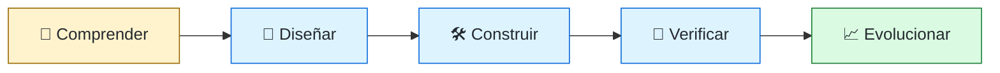
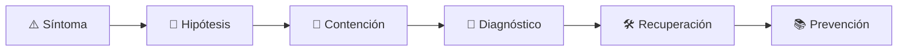

# 🧑‍💻 Software Engineer
<!-- role-visual:start -->

**La guía conecta trabajo real, decisiones, clases concretas y evidencia defendible.**

<!-- role-visual:end -->

> Convierte necesidades y restricciones en software comprensible, verificable y
> capaz de evolucionar. Es el tronco profesional del que parten las especialidades.
>
> **Entrada habitual:** junior · **Foco:** construcción, colaboración y ciclo de vida
> completo · **Evidencia central:** un cambio que funciona, se prueba y se puede mantener

## 🧭 Qué es y por qué importa

Software Engineer no significa “persona que escribe código”. El rol comprende el
problema, reduce ambigüedad, diseña una solución proporcional, implementa, prueba,
entrega, observa y mantiene. En equipos pequeños puede recorrer todo el ciclo; en
organizaciones grandes trabaja dentro de un dominio y coordina con producto,
plataforma, calidad, seguridad y operaciones.

Importa porque la mayor parte del coste de un sistema aparece después de su primera
versión. El trabajo profesional deja una base que otra persona puede comprender y
cambiar sin depender de memoria privada.

## 🗓️ Un día en el puesto

- aclarar una historia o requisito y detectar un supuesto oculto;
- leer código ajeno, reproducir un fallo y localizar la primera divergencia;
- implementar un cambio pequeño con pruebas y compatibilidad;
- revisar una contribución explicando riesgo, no imponiendo preferencias;
- observar una métrica o log después de desplegar;
- actualizar documentación y comunicar deuda o límites.

## ✅ Responsabilidades y límites

- Responde por la calidad del cambio, no solo por “terminar el ticket”.
- Participa en diseño y operación aunque exista un equipo especializado.
- No decide prioridades de negocio en solitario.
- No delega seguridad, accesibilidad o pruebas como si fueran inspecciones finales.
- No necesita conocer todos los lenguajes; necesita transferir principios entre ellos.

## 🧠 Qué necesitas saber

**Base técnica:** programación, estructuras de datos, sistemas operativos, redes,
depuración, Git, contratos, diseño modular, pruebas, datos y APIs.

**Base de ingeniería:** requisitos, trade-offs, estimación con incertidumbre,
observabilidad, seguridad, documentación y mantenimiento.

**Habilidades humanas:** pedir contexto, escribir decisiones, aceptar revisión,
explicar riesgos y dividir trabajo sin perder el objetivo común.

## 📚 Tu ruta en el programa

1. Partes 00–04: profesión, computador, sistema operativo, red y razonamiento.
2. Partes 05–09: programación, paradigmas, algoritmos, herramientas y paquetes.
3. Partes 10–17: producto, requisitos, especificaciones, procesos, Git y documentación.
4. Partes 24–25 y 30–32: diseño, arquitectura, pruebas, calidad y seguridad.
5. Parte 35: observabilidad e incidentes; Parte 36: evolución y legacy.
6. Partes 38–39: IA y agentes bajo verificación humana.

Empieza por [la Parte 00](../classes/part-00-ingenieria-de-software-como-profesion/README.md)
y usa el [índice completo](../classes/README.md) para seguir la secuencia.

<!-- role-depth:start -->
## 🗺️ Sistema profesional del rol

El gráfico no representa una cascada rígida. Muestra el bucle profesional que este rol
debe poder recorrer: comprender el contexto, tomar una decisión, intervenir, observar
el efecto y convertir lo aprendido en una mejora. En **🧑‍💻 Software Engineer**, saltar directamente a
la herramienta suele ocultar el problema, mientras que terminar sin evidencia deja la
decisión en una opinión. La misión concreta es: Convierte necesidades y restricciones en software comprensible, verificable y capaz de evolucionar. Es el tronco profesional del que parten las especialidades. Cada transición
debe conservar supuestos, responsables y una forma de volver atrás.

<table>
<tr>
<td valign="top" width="50%">

### 🎯 Responde por

- decisiones propias de la familia **Ingeniería general**;
- el resultado observable, no sólo la actividad ejecutada;
- límites, riesgos, operación y deuda residual de su intervención;
- evidencia que otra persona pueda revisar o reproducir.

</td>
<td valign="top" width="50%">

### 🤝 Coordina con

- [⚙️ Backend Engineer](backend-engineer.md); [🧪 QA / Test Automation Engineer](qa-test-engineer.md); [🧭 Staff / Principal Engineer y Technical Lead](technical-leadership.md);
- producto y personas usuarias cuando cambia una tarea o outcome;
- seguridad, privacidad, accesibilidad y operación según el riesgo;
- quienes mantendrán el sistema después de la entrega.

</td>
</tr>
</table>

El título no concede autoridad automática. El alcance real depende del equipo, la
industria y la criticidad. Esta guía describe un recorrido desde **fundamentos → senior**, pero una
vacante se evalúa por las decisiones que permite tomar, los sistemas que pone bajo
responsabilidad y la evidencia exigida, no por el nombre del cargo.

## 🧱 Partes y clases asociadas

La ruta distingue **parte** —unidad curricular con una capacidad acumulativa— de
**clase asociada** —punto concreto donde se estudia un mecanismo o una decisión. Las
clases siguientes forman el núcleo; no eliminan los prerrequisitos indicados en sus
propias páginas ni convierten en opcional la base común.

| Orden | Parte del programa | Clases clave | Por qué entra en esta ruta | Evidencia de transferencia |
| ---: | --- | --- | --- | --- |
| 1 | [Parte 05 · Fundamentos de programación](../classes/part-05-fundamentos-de-programacion/README.md) | [SE-068 · Módulos, interfaces y separación de responsabilidades](../classes/part-05-fundamentos-de-programacion/se-068-modulos-interfaces-y-separacion-de-responsabilidades/README.md) [SE-069 · Pruebas tempranas y diseño por ejemplos](../classes/part-05-fundamentos-de-programacion/se-069-pruebas-tempranas-y-diseno-por-ejemplos/README.md) [SE-070 · Legibilidad, nombres y mantenimiento básico](../classes/part-05-fundamentos-de-programacion/se-070-legibilidad-nombres-y-mantenimiento-basico/README.md) | Profundiza **programación modular, errores y pruebas tempranas** desde la responsabilidad del rol. | Herramienta probada y mantenible. |
| 2 | [Parte 24 · Diseño, patrones y refactorización](../classes/part-24-diseno-patrones-y-refactorizacion/README.md) | [SE-289 · Cohesión, acoplamiento y encapsulación](../classes/part-24-diseno-patrones-y-refactorizacion/se-289-cohesion-acoplamiento-y-encapsulacion/README.md) [SE-295 · Refactorización segura apoyada por pruebas](../classes/part-24-diseno-patrones-y-refactorizacion/se-295-refactorizacion-segura-apoyada-por-pruebas/README.md) [SE-296 · Diseño para cambio, prueba y operación](../classes/part-24-diseno-patrones-y-refactorizacion/se-296-diseno-para-cambio-prueba-y-operacion/README.md) | Profundiza **diseño, patrones y refactorización segura** desde la responsabilidad del rol. | Evolución compatible protegida por pruebas. |
| 3 | [Parte 30 · Estrategia y técnicas de prueba](../classes/part-30-estrategia-y-tecnicas-de-prueba/README.md) | [SE-361 · Calidad por riesgo y propósito de las pruebas](../classes/part-30-estrategia-y-tecnicas-de-prueba/se-361-calidad-por-riesgo-y-proposito-de-las-pruebas/README.md) [SE-363 · Integración, componentes y contratos](../classes/part-30-estrategia-y-tecnicas-de-prueba/se-363-integracion-componentes-y-contratos/README.md) [SE-371 · Taller: demostrar que una prueba detecta defectos](../classes/part-30-estrategia-y-tecnicas-de-prueba/se-371-taller-demostrar-que-una-prueba-detecta-defectos/README.md) | Profundiza **estrategia de pruebas guiada por riesgo** desde la responsabilidad del rol. | Suite que demuestra detección de defectos. |
| 4 | [Parte 35 · Observabilidad, SRE e incidentes](../classes/part-35-observabilidad-sre-e-incidentes/README.md) | [SE-421 · Señales, eventos y observabilidad útil](../classes/part-35-observabilidad-sre-e-incidentes/se-421-senales-eventos-y-observabilidad-util/README.md) [SE-428 · Gestión de incidentes y comunicación](../classes/part-35-observabilidad-sre-e-incidentes/se-428-gestion-de-incidentes-y-comunicacion/README.md) [SE-430 · Continuidad, disaster recovery y ejercicios](../classes/part-35-observabilidad-sre-e-incidentes/se-430-continuidad-disaster-recovery-y-ejercicios/README.md) | Profundiza **observabilidad, SRE e incidentes** desde la responsabilidad del rol. | Incidente diagnosticado y recuperado. |

**Cómo recorrerla.** Empieza por [SE-068](../classes/part-05-fundamentos-de-programacion/se-068-modulos-interfaces-y-separacion-de-responsabilidades/README.md) para fijar el
primer mecanismo, usa [SE-361](../classes/part-30-estrategia-y-tecnicas-de-prueba/se-361-calidad-por-riesgo-y-proposito-de-las-pruebas/README.md) para integrar el
centro de la especialidad y llega a [SE-430](../classes/part-35-observabilidad-sre-e-incidentes/se-430-continuidad-disaster-recovery-y-ejercicios/README.md) cuando ya
puedas explicar cómo detectar y recuperar un fallo. Una clase se considera estudiada
sólo cuando su concepto cambia una decisión y deja evidencia; abrir todos los enlaces
no constituye competencia.

> [!IMPORTANT]
> El mapa expresa el currículo previsto. Las Partes 00–05 están desarrolladas; las
> posteriores conservan borradores o estructuras que deben superar revisión
> cualitativa. Esta ruta no declara terminadas esas clases ni reemplaza el
> [roadmap](../ROADMAP.md).

## ⚖️ Decisiones y trade-offs que debes defender

| Decisión recurrente | Criterio profesional | Evidencia mínima antes de defenderla |
| --- | --- | --- |
| **Velocidad o mantenibilidad** | Hacer explícito el coste futuro y la reversibilidad. | Medir cambio seguro y deuda residual. |
| **Abstracción o simplicidad** | Introducir una capa sólo cuando elimina duplicación conceptual. | Probar que reduce acoplamiento sin ocultar el dominio. |
| **Entrega o estabilidad** | Graduar riesgo por tamaño impacto y recuperación. | Observar fallos y demostrar rollback. |

La calidad de una decisión no se juzga porque coincida con una herramienta popular.
Debe hacer explícitos contexto, restricciones, alternativas descartadas, coste de
cambio y condición de revisión. En especial, **Velocidad o mantenibilidad**, **Abstracción o simplicidad**
y **Entrega o estabilidad** cambian de respuesta cuando cambia el riesgo. Una solución
correcta en un prototipo puede ser irresponsable en un sistema regulado; una solución
robusta para un servicio crítico puede ser desperdicio en una herramienta interna.

## 🚨 Escenario profesional: Cambio pequeño que rompe un flujo vecino

**Síntoma.** Una modificación aparentemente local produce errores en otro módulo. La respuesta madura evita convertir la primera
correlación en causa y conserva evidencia antes de modificar el sistema.

1. **Detectar y delimitar:** identifica quién o qué está afectado, desde cuándo y qué
   cambió. Conserva timestamps, versiones, entradas y señales suficientes para no
   destruir la escena al intentar arreglarla.
2. **Investigar:** Reconstruir dependencias invariantes y contrato afectado. Formula al menos dos hipótesis rivales
   y define qué observación refutaría cada una.
3. **Contener:** reduce blast radius y daño sin prometer una corrección todavía. La
   contención debe ser reversible, visible y compatible con las obligaciones del
   sistema.
4. **Recuperar:** Contener revertir y añadir una prueba que reproduzca el fallo. Verifica la tarea completa, no sólo que un
   proceso volvió a estar verde.
5. **Aprender:** añade una regresión, señal o control que detecte la misma clase de
   fallo. Documenta qué deuda permanece y quién revisará la acción.

El escenario evalúa método además de resultado. Una recuperación rápida que borra la
causa, oculta pérdida de datos o deja al equipo sin mecanismo preventivo no demuestra
dominio del rol.

## 📊 Señales útiles y límites de las métricas

| Señal | Qué ayuda a observar | Trampa que debe evitarse |
| --- | --- | --- |
| **Tiempo de ciclo** | Rapidez desde intención hasta evidencia. | Optimizar velocidad ignorando calidad. |
| **Defectos escapados** | Riesgo que llega a usuarios u operación. | Contar bugs sin severidad ni exposición. |
| **Tiempo de recuperación** | Capacidad para restaurar servicio y aprendizaje. | Celebrar promedios que ocultan incidentes largos. |

Ninguna señal debe convertirse en ranking individual. Combina tendencia cuantitativa,
muestreo de casos, feedback cualitativo y contexto de carga. Declara ventana,
denominador, fuente, exclusiones y quién puede actuar sobre el resultado. Si una
métrica mejora mientras el outcome o el riesgo empeoran, el sistema está optimizando
el indicador y no el trabajo.

## 🧩 Proyecto integrador del rol: Producto vertical operable

**Propósito:** entregar una capacidad desde requisito hasta operación y mantenimiento. El resultado esperado es **código contrato pruebas ADR telemetría runbook y retrospectiva**.

Entrega un expediente revisable con estas piezas:

1. **Contexto y alcance:** usuario, sistema, restricción, supuestos, fuera de alcance y
   criterio de no éxito.
2. **Decisión:** al menos dos alternativas reales, trade-offs, coste de reversión y un
   ADR o memo que indique cuándo revisar la elección.
3. **Artefacto principal:** una implementación, modelo, flujo o política coherente con
   las clases núcleo; no una captura aislada ni una presentación sin mecanismo.
4. **Fallo controlado:** introduce una condición adversa relacionada con el escenario
   anterior y conserva el resultado observado, sin inventar una ejecución.
5. **Verificación:** prueba, rúbrica, revisión o medición que pueda fallar y que conecte
   directamente con el resultado profesional.
6. **Operación y salida:** telemetría, recuperación, mantenimiento, deprecación o retiro
   según corresponda; incluye límites y deuda residual.

**Criterio de aceptación:** otra persona puede reconstruir el razonamiento, reproducir
la comprobación y distinguir claramente qué quedó demostrado de lo que sólo se propone.
El proyecto no se aprueba por cantidad de archivos ni por utilizar una marca concreta.

## 📈 Dominio esperado por alcance

| Alcance | Qué resuelve | Qué evidencia su autonomía |
| --- | --- | --- |
| **Inicial** | ejecuta una tarea acotada con criterios y acompañamiento | reproduce el caso, pregunta por supuestos y entrega evidencia legible |
| **Intermedio** | decide dentro de un componente o flujo conocido | compara alternativas, prueba fallos previsibles y coordina dependencias |
| **Senior** | conduce problemas ambiguos que cruzan sistemas o equipos | hace explícito el riesgo, diseña recuperación y mejora el mecanismo de trabajo |
| **Staff / Lead** | cambia capacidades compartidas y decisiones de largo plazo | multiplica criterio, define guardrails, mide adopción y conserva opciones futuras |

Progresar no significa alejarse de la práctica. Significa aumentar ambigüedad, horizonte,
blast radius y responsabilidad por consecuencias. La persona senior todavía debe poder
explicar el mecanismo; la persona Staff además crea condiciones para que otros lo
operen sin depender de ella.

## 🗓️ Plan de práctica 30 · 60 · 90 días

- **Días 1–30 — comprender y reproducir.** Estudia las primeras clases de cada parte,
  reproduce un caso pequeño y escribe un mapa de responsabilidades. El entregable es
  una baseline con preguntas abiertas, no una transformación prematura.
- **Días 31–60 — intervenir y fallar con control.** Construye el artefacto central,
  introduce el escenario de fallo y mide el comportamiento. Revisa el trabajo con una
  persona de una ruta vecina para descubrir supuestos de frontera.
- **Días 61–90 — operar y transferir.** Ejecuta recuperación, corrige la causa, publica
  runbook o guía de uso y presenta la decisión con trade-offs. Termina con una
  retrospectiva que separe resultado, evidencia, límites y siguiente inversión.

Este plan es una secuencia de práctica, no una promesa de empleabilidad en noventa días.
La experiencia previa, el dominio y el acceso a sistemas reales cambian el tiempo
necesario.

## 🎤 Preguntas para revisión o entrevista

1. ¿En qué contexto elegirías **Velocidad o mantenibilidad** y qué evidencia te haría cambiar?
2. ¿Cómo distinguirías síntoma, causa y daño en el escenario **Cambio pequeño que rompe un flujo vecino**?
3. ¿Qué clase asociada usarías para diseñar el mecanismo y cuál para verificarlo?
4. ¿Qué parte de **Producto vertical operable** no automatizarías todavía y por qué?
5. ¿Qué métrica podría mejorar mientras el sistema empeora y qué guardrail añadirías?
6. ¿Dónde termina la autoridad de este rol y cuándo debe escalar o pedir revisión?

Una respuesta fuerte usa un caso, reconoce incertidumbre y propone una comprobación.
Nombrar una herramienta sin explicar mecanismo, fallo y límite no demuestra la
competencia.

## 🔗 Fuentes primarias y oficiales

- [SWEBOK Guide v4.0a](https://www.computer.org/education/bodies-of-knowledge/software-engineering) — **IEEE Computer Society**. Se usa como referencia primaria u oficial; la guía no sustituye la fuente.
- [ISO/IEC 25010:2023](https://www.iso.org/standard/78176.html) — **ISO**. Se usa como referencia primaria u oficial; la guía no sustituye la fuente.
- [ACM Code of Ethics and Professional Conduct](https://www.acm.org/code-of-ethics) — **ACM**. Se usa como referencia primaria u oficial; la guía no sustituye la fuente.

Las fuentes orientan principios, vocabulario y prácticas; no convierten la guía en una
certificación ni sustituyen la documentación específica del sistema, la jurisdicción
o la tecnología utilizada.
<!-- role-depth:end -->

## 🧪 Evidencia de portafolio

- una aplicación pequeña con requisitos, ADR, pruebas y release reproducible;
- un bug investigado con hipótesis, causa raíz y prueba de regresión;
- un cambio compatible sobre código que no escribiste;
- una revisión de código que mejora riesgo, claridad o mantenibilidad;
- un runbook corto para detectar y recuperar un fallo realista.

## 📈 Progresión

Junior → Software Engineer → Senior. Desde Senior puedes profundizar como especialista,
avanzar hacia Staff/Principal, moverte a arquitectura o plataforma, o elegir gestión.
El salto no depende del número de frameworks: aumenta el alcance, la ambigüedad y la
capacidad de mejorar el trabajo de otras personas.

## ⚠️ Mitos frecuentes

- “Senior es quien programa más rápido.” La velocidad sin decisiones sostenibles crea deuda.
- “Los requisitos llegan completos.” Parte del trabajo es descubrir contradicciones.
- “Cuando pasa CI está terminado.” Todavía pueden fallar uso, operación o evolución.
- “La IA reemplaza la revisión.” Acelera propuestas; no asume responsabilidad.

## 🚀 Siguientes pasos

1. Completa la base común de las partes 00–09.
2. Construye un fragmento vertical y documenta una decisión no trivial.
3. Haz que otra persona lo ejecute desde cero y corrige las instrucciones.
4. Elige una ruta especializada por el problema que quieres resolver, no por moda.

---

[⬅️ Volver a las rutas](README.md) · [🏠 Inicio del programa](../README.md)
