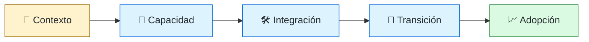
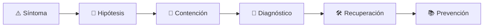

# 🧩 Solutions Architect
<!-- role-visual:start -->

**La guía conecta trabajo real, decisiones, clases concretas y evidencia defendible.**

<!-- role-visual:end -->

> Convierte un contexto de cliente u organización en una solución integrable,
> operable y económicamente defendible sin vender supuestos como garantías.
>
> **Entrada habitual:** senior · **Foco:** integración, restricciones y adopción
> · **Evidencia central:** arquitectura de solución con riesgos, costes y transición

## 🧭 Qué es y por qué importa

Solutions architecture trabaja en la frontera entre necesidad, producto, tecnología y
adopción. A diferencia del software architect centrado en la evolución interna de un
sistema, debe integrar capacidades existentes, terceros y realidad operativa del cliente.

## 🗓️ Un día en el puesto

- descubrir objetivos, restricciones y landscape existente;
- modelar integración, identidad, datos y operación;
- construir un proof of concept limitado a una incertidumbre;
- estimar TCO, riesgos y plan de transición;
- entregar decisiones y límites a quienes implementan y operan.

## ✅ Responsabilidades y límites

- Responde por coherencia de la propuesta y honestidad de supuestos.
- Distingue demo, PoC, piloto y producción.
- No compromete roadmap, seguridad o SLA que no controla.
- No reemplaza discovery ni diseño detallado del equipo implementador.

## 🧠 Qué necesitas saber

Discovery, requisitos, arquitectura, APIs, identidad, datos, cloud, integración,
seguridad, confiabilidad, migración, licencias, TCO, comunicación, negociación,
diagramas, ADR y gestión de riesgos.

## 📚 Tu ruta en el programa

1. Partes 00 y 10–17 para profesión, discovery, economía y acuerdos.
2. Partes 19–24 y [Parte 25 — Arquitectura de software y dominio](../classes/part-25-arquitectura-de-software-y-dominio/README.md) para superficies, diseño y límites.
3. Partes 31–36 para calidad, seguridad, operación y transición.
4. Parte 37 para influencia; partes 38–39 para soluciones con IA y agentes.

<!-- role-depth:start -->
## 🗺️ Sistema profesional del rol

El gráfico no representa una cascada rígida. Muestra el bucle profesional que este rol
debe poder recorrer: comprender el contexto, tomar una decisión, intervenir, observar
el efecto y convertir lo aprendido en una mejora. En **🧩 Solutions Architect**, saltar directamente a
la herramienta suele ocultar el problema, mientras que terminar sin evidencia deja la
decisión en una opinión. La misión concreta es: Convierte un contexto de cliente u organización en una solución integrable, operable y económicamente defendible sin vender supuestos como garantías. Cada transición
debe conservar supuestos, responsables y una forma de volver atrás.

<table>
<tr>
<td valign="top" width="50%">

### 🎯 Responde por

- decisiones propias de la familia **Diseño de soluciones**;
- el resultado observable, no sólo la actividad ejecutada;
- límites, riesgos, operación y deuda residual de su intervención;
- evidencia que otra persona pueda revisar o reproducir.

</td>
<td valign="top" width="50%">

### 🤝 Coordina con

- [🏛️ Software Architect](software-architect.md); [🧭 Technical Product Engineer](technical-product-engineer.md); [☁️ Cloud Engineer](cloud-engineer.md);
- producto y personas usuarias cuando cambia una tarea o outcome;
- seguridad, privacidad, accesibilidad y operación según el riesgo;
- quienes mantendrán el sistema después de la entrega.

</td>
</tr>
</table>

El título no concede autoridad automática. El alcance real depende del equipo, la
industria y la criticidad. Esta guía describe un recorrido desde **senior → principal**, pero una
vacante se evalúa por las decisiones que permite tomar, los sistemas que pone bajo
responsabilidad y la evidencia exigida, no por el nombre del cargo.

## 🧱 Partes y clases asociadas

La ruta distingue **parte** —unidad curricular con una capacidad acumulativa— de
**clase asociada** —punto concreto donde se estudia un mecanismo o una decisión. Las
clases siguientes forman el núcleo; no eliminan los prerrequisitos indicados en sus
propias páginas ni convierten en opcional la base común.

| Orden | Parte del programa | Clases clave | Por qué entra en esta ruta | Evidencia de transferencia |
| ---: | --- | --- | --- | --- |
| 1 | [Parte 10 · Descubrimiento y estrategia de producto](../classes/part-10-descubrimiento-y-estrategia-de-producto/README.md) | [SE-121 · Problemas, síntomas, necesidades y oportunidades](../classes/part-10-descubrimiento-y-estrategia-de-producto/se-121-problemas-sintomas-necesidades-y-oportunidades/README.md) [SE-126 · Segmentación, mercado y alternativas existentes](../classes/part-10-descubrimiento-y-estrategia-de-producto/se-126-segmentacion-mercado-y-alternativas-existentes/README.md) [SE-128 · Priorización por valor, riesgo y aprendizaje](../classes/part-10-descubrimiento-y-estrategia-de-producto/se-128-priorizacion-por-valor-riesgo-y-aprendizaje/README.md) | Profundiza **discovery, usuarios, hipótesis y valor** desde la responsabilidad del rol. | Dossier de problema y decisión. |
| 2 | [Parte 25 · Arquitectura de software y dominio](../classes/part-25-arquitectura-de-software-y-dominio/README.md) | [SE-301 · Drivers, restricciones y atributos de arquitectura](../classes/part-25-arquitectura-de-software-y-dominio/se-301-drivers-restricciones-y-atributos-de-arquitectura/README.md) [SE-302 · Vistas lógica, runtime, datos y despliegue](../classes/part-25-arquitectura-de-software-y-dominio/se-302-vistas-logica-runtime-datos-y-despliegue/README.md) [SE-309 · Trade-offs, ADR y evaluación de alternativas](../classes/part-25-arquitectura-de-software-y-dominio/se-309-trade-offs-adr-y-evaluacion-de-alternativas/README.md) | Profundiza **arquitectura, dominio y atributos de calidad** desde la responsabilidad del rol. | Arquitectura defendible con ADR. |
| 3 | [Parte 29 · Cloud, plataforma e infraestructura](../classes/part-29-cloud-plataforma-e-infraestructura/README.md) | [SE-349 · IaaS, PaaS, SaaS y responsabilidad compartida](../classes/part-29-cloud-plataforma-e-infraestructura/se-349-iaas-paas-saas-y-responsabilidad-compartida/README.md) [SE-357 · Multi-cloud, híbrido y portabilidad real](../classes/part-29-cloud-plataforma-e-infraestructura/se-357-multi-cloud-hibrido-y-portabilidad-real/README.md) [SE-360 · Proyecto: plataforma mínima reproducible](../classes/part-29-cloud-plataforma-e-infraestructura/se-360-proyecto-plataforma-minima-reproducible/README.md) | Profundiza **cloud, infraestructura y plataformas** desde la responsabilidad del rol. | Entorno reproducible y eliminable. |
| 4 | [Parte 37 · Gestión, liderazgo y práctica profesional](../classes/part-37-gestion-liderazgo-y-practica-profesional/README.md) | [SE-450 · Gestión de riesgos y decisiones ejecutivas](../classes/part-37-gestion-liderazgo-y-practica-profesional/se-450-gestion-de-riesgos-y-decisiones-ejecutivas/README.md) [SE-451 · Compras, proveedores y evaluación técnica](../classes/part-37-gestion-liderazgo-y-practica-profesional/se-451-compras-proveedores-y-evaluacion-tecnica/README.md) [SE-455 · Taller: conducir una revisión de decisión difícil](../classes/part-37-gestion-liderazgo-y-practica-profesional/se-455-taller-conducir-una-revision-de-decision-dificil/README.md) | Profundiza **liderazgo, organización y decisiones** desde la responsabilidad del rol. | Propuesta defendida ante conflicto. |

**Cómo recorrerla.** Empieza por [SE-121](../classes/part-10-descubrimiento-y-estrategia-de-producto/se-121-problemas-sintomas-necesidades-y-oportunidades/README.md) para fijar el
primer mecanismo, usa [SE-349](../classes/part-29-cloud-plataforma-e-infraestructura/se-349-iaas-paas-saas-y-responsabilidad-compartida/README.md) para integrar el
centro de la especialidad y llega a [SE-455](../classes/part-37-gestion-liderazgo-y-practica-profesional/se-455-taller-conducir-una-revision-de-decision-dificil/README.md) cuando ya
puedas explicar cómo detectar y recuperar un fallo. Una clase se considera estudiada
sólo cuando su concepto cambia una decisión y deja evidencia; abrir todos los enlaces
no constituye competencia.

> [!IMPORTANT]
> El mapa expresa el currículo previsto. Las Partes 00–01 están desarrolladas; las
> posteriores conservan borradores o estructuras que deben superar revisión
> cualitativa. Esta ruta no declara terminadas esas clases ni reemplaza el
> [roadmap](../ROADMAP.md).

## ⚖️ Decisiones y trade-offs que debes defender

| Decisión recurrente | Criterio profesional | Evidencia mínima antes de defenderla |
| --- | --- | --- |
| **Build buy o partner** | Comparar diferenciación TCO dependencia y estrategia de salida. | Prueba de concepto más matriz económica. |
| **Producto o plataforma** | Definir consumidor ownership y operación antes de la tecnología. | Service blueprint y RACI. |
| **Migración directa o coexistencia** | Reducir riesgo mediante etapas observables. | Plan de transición con rollback. |

La calidad de una decisión no se juzga porque coincida con una herramienta popular.
Debe hacer explícitos contexto, restricciones, alternativas descartadas, coste de
cambio y condición de revisión. En especial, **Build buy o partner**, **Producto o plataforma**
y **Migración directa o coexistencia** cambian de respuesta cuando cambia el riesgo. Una solución
correcta en un prototipo puede ser irresponsable en un sistema regulado; una solución
robusta para un servicio crítico puede ser desperdicio en una herramienta interna.

## 🚨 Escenario profesional: Proveedor cumple demo pero falla al integrar identidad y datos reales

**Síntoma.** La evaluación omitió restricciones no funcionales y modelo operativo. La respuesta madura evita convertir la primera
correlación en causa y conserva evidencia antes de modificar el sistema.

1. **Detectar y delimitar:** identifica quién o qué está afectado, desde cuándo y qué
   cambió. Conserva timestamps, versiones, entradas y señales suficientes para no
   destruir la escena al intentar arreglarla.
2. **Investigar:** Revisar contrato capacidades límites SLAs datos seguridad soporte y salida. Formula al menos dos hipótesis rivales
   y define qué observación refutaría cada una.
3. **Contener:** reduce blast radius y daño sin prometer una corrección todavía. La
   contención debe ser reversible, visible y compatible con las obligaciones del
   sistema.
4. **Recuperar:** Contener alcance validar integración y renegociar decisión con evidencia. Verifica la tarea completa, no sólo que un
   proceso volvió a estar verde.
5. **Aprender:** añade una regresión, señal o control que detecte la misma clase de
   fallo. Documenta qué deuda permanece y quién revisará la acción.

El escenario evalúa método además de resultado. Una recuperación rápida que borra la
causa, oculta pérdida de datos o deja al equipo sin mecanismo preventivo no demuestra
dominio del rol.

## 📊 Señales útiles y límites de las métricas

| Señal | Qué ayuda a observar | Trampa que debe evitarse |
| --- | --- | --- |
| **Tiempo hasta valor** | Duración desde decisión hasta uso efectivo. | Medir firma de contrato. |
| **Costo total por escenario** | Construcción integración operación cambio y salida. | Comparar sólo licencias. |
| **Riesgos abiertos** | Supuestos sin owner evidencia o fecha de revisión. | Convertir todo en semáforo verde. |

Ninguna señal debe convertirse en ranking individual. Combina tendencia cuantitativa,
muestreo de casos, feedback cualitativo y contexto de carga. Declara ventana,
denominador, fuente, exclusiones y quién puede actuar sobre el resultado. Si una
métrica mejora mientras el outcome o el riesgo empeoran, el sistema está optimizando
el indicador y no el trabajo.

## 🧩 Proyecto integrador del rol: Solución transitable de contexto a operación

**Propósito:** resolver una necesidad combinando componentes propios y externos con salida explícita. El resultado esperado es **mapa de capacidades opciones PoC arquitectura integración TCO riesgos plan de transición y aceptación**.

Entrega un expediente revisable con estas piezas:

1. **Contexto y alcance:** usuario, sistema, restricción, supuestos, fuera de alcance y
   criterio de no éxito.
2. **Decisión:** al menos dos alternativas reales, trade-offs, coste de reversión y un
   ADR o memo que indique cuándo revisar la elección.
3. **Artefacto principal:** una implementación, modelo, flujo o política coherente con
   las clases núcleo; no una captura aislada ni una presentación sin mecanismo.
4. **Fallo controlado:** introduce una condición adversa relacionada con el escenario
   anterior y conserva el resultado observado, sin inventar una ejecución.
5. **Verificación:** prueba, rúbrica, revisión o medición que pueda fallar y que conecte
   directamente con el resultado profesional.
6. **Operación y salida:** telemetría, recuperación, mantenimiento, deprecación o retiro
   según corresponda; incluye límites y deuda residual.

**Criterio de aceptación:** otra persona puede reconstruir el razonamiento, reproducir
la comprobación y distinguir claramente qué quedó demostrado de lo que sólo se propone.
El proyecto no se aprueba por cantidad de archivos ni por utilizar una marca concreta.

## 📈 Dominio esperado por alcance

| Alcance | Qué resuelve | Qué evidencia su autonomía |
| --- | --- | --- |
| **Inicial** | ejecuta una tarea acotada con criterios y acompañamiento | reproduce el caso, pregunta por supuestos y entrega evidencia legible |
| **Intermedio** | decide dentro de un componente o flujo conocido | compara alternativas, prueba fallos previsibles y coordina dependencias |
| **Senior** | conduce problemas ambiguos que cruzan sistemas o equipos | hace explícito el riesgo, diseña recuperación y mejora el mecanismo de trabajo |
| **Staff / Lead** | cambia capacidades compartidas y decisiones de largo plazo | multiplica criterio, define guardrails, mide adopción y conserva opciones futuras |

Progresar no significa alejarse de la práctica. Significa aumentar ambigüedad, horizonte,
blast radius y responsabilidad por consecuencias. La persona senior todavía debe poder
explicar el mecanismo; la persona Staff además crea condiciones para que otros lo
operen sin depender de ella.

## 🗓️ Plan de práctica 30 · 60 · 90 días

- **Días 1–30 — comprender y reproducir.** Estudia las primeras clases de cada parte,
  reproduce un caso pequeño y escribe un mapa de responsabilidades. El entregable es
  una baseline con preguntas abiertas, no una transformación prematura.
- **Días 31–60 — intervenir y fallar con control.** Construye el artefacto central,
  introduce el escenario de fallo y mide el comportamiento. Revisa el trabajo con una
  persona de una ruta vecina para descubrir supuestos de frontera.
- **Días 61–90 — operar y transferir.** Ejecuta recuperación, corrige la causa, publica
  runbook o guía de uso y presenta la decisión con trade-offs. Termina con una
  retrospectiva que separe resultado, evidencia, límites y siguiente inversión.

Este plan es una secuencia de práctica, no una promesa de empleabilidad en noventa días.
La experiencia previa, el dominio y el acceso a sistemas reales cambian el tiempo
necesario.

## 🎤 Preguntas para revisión o entrevista

1. ¿En qué contexto elegirías **Build buy o partner** y qué evidencia te haría cambiar?
2. ¿Cómo distinguirías síntoma, causa y daño en el escenario **Proveedor cumple demo pero falla al integrar identidad y datos reales**?
3. ¿Qué clase asociada usarías para diseñar el mecanismo y cuál para verificarlo?
4. ¿Qué parte de **Solución transitable de contexto a operación** no automatizarías todavía y por qué?
5. ¿Qué métrica podría mejorar mientras el sistema empeora y qué guardrail añadirías?
6. ¿Dónde termina la autoridad de este rol y cuándo debe escalar o pedir revisión?

Una respuesta fuerte usa un caso, reconoce incertidumbre y propone una comprobación.
Nombrar una herramienta sin explicar mecanismo, fallo y límite no demuestra la
competencia.

## 🔗 Fuentes primarias y oficiales

- [ISO/IEC 25010:2023](https://www.iso.org/standard/78176.html) — **ISO**. Se usa como referencia primaria u oficial; la guía no sustituye la fuente.
- [OpenAPI Specification](https://spec.openapis.org/oas/latest.html) — **OpenAPI Initiative**. Se usa como referencia primaria u oficial; la guía no sustituye la fuente.
- [C4 model](https://c4model.com/) — **Simon Brown**. Se usa como referencia primaria u oficial; la guía no sustituye la fuente.

Las fuentes orientan principios, vocabulario y prácticas; no convierten la guía en una
certificación ni sustituyen la documentación específica del sistema, la jurisdicción
o la tecnología utilizada.
<!-- role-depth:end -->

## 🧪 Evidencia de portafolio

- mapa de contexto, stakeholders y restricciones;
- alternativa recomendada frente a build/buy y no hacer;
- PoC con pregunta, criterio y límites explícitos;
- plan de integración, migración, operación y coste.

## 📈 Progresión

Senior Engineer/Consultant → Solutions Architect → Principal Solutions Architect.

## ⚠️ Mitos frecuentes

- “El diagrama es la solución.” Faltan contratos, operación y transición.
- “Un PoC valida producción.” Sólo reduce la incertidumbre que fue diseñado para medir.
- “El producto encaja si se configura.” Puede exigir cambios organizacionales y de datos.

## 🚀 Siguientes pasos

1. Separa necesidades, restricciones y preferencias del cliente.
2. Diseña un PoC que responda una incertidumbre decisiva.
3. Entrega riesgos, costes y responsabilidades junto con el diagrama.

---

[⬅️ Volver a las rutas](README.md) · [🏠 Inicio del programa](../README.md)
