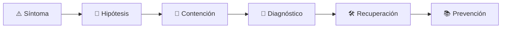

# ⚙️ Systems Programmer
<!-- role-visual:start -->

**La guía conecta trabajo real, decisiones, clases concretas y evidencia defendible.**

<!-- role-visual:end -->

> Construye software cercano al sistema operativo y al runtime con control explícito
> de memoria, concurrencia, recursos, interfaces y portabilidad.
>
> **Entrada habitual:** semi-senior · **Foco:** runtimes, procesos y rendimiento
> · **Evidencia central:** componente medido con invariantes y fallos de recursos probados

## 🧭 Qué es y por qué importa

Systems programming crea runtimes, motores, drivers, bases de datos, herramientas y
componentes donde una abstracción insuficiente se convierte en corrupción, deadlock o
degradación. Exige razonar desde hardware y sistema operativo hasta API pública.

## 🗓️ Un día en el puesto

- depurar memoria, syscall, bloqueo o carrera;
- perfilar CPU, caché e I/O;
- diseñar una interfaz estable y manejo de recursos;
- revisar comportamiento indefinido y portabilidad;
- ejecutar fuzzing, sanitizers y benchmarks.

## ✅ Responsabilidades y límites

- Responde por seguridad de memoria, recursos y semántica de concurrencia.
- Elige C, C++, Rust u otra herramienta por restricciones verificadas.
- No usa bajo nivel como sinónimo de rendimiento sin medir.
- No expone primitivas peligrosas sin contrato y encapsulación.

## 🧠 Qué necesitas saber

Arquitectura de computador, memoria, procesos, syscalls, compilación, linking,
ABI, concurrencia, estructuras de datos, redes, archivos, debugging, profiling,
property testing, fuzzing, portabilidad y reproducible builds.

## 📚 Tu ruta en el programa

1. [Parte 01 — Computadores y representación](../classes/part-01-computadores-y-representacion-de-informacion/README.md) y partes 02–09 como núcleo de máquina, programación y herramientas.
2. Partes 18 y 22 para servicios, automatización y embedded.
3. Partes 24, 26 y 28 para diseño, almacenamiento y concurrencia.
4. Partes 30–33 para pruebas, resiliencia, seguridad y build.

<!-- role-depth:start -->
## 🗺️ Sistema profesional del rol

El gráfico no representa una cascada rígida. Muestra el bucle profesional que este rol
debe poder recorrer: comprender el contexto, tomar una decisión, intervenir, observar
el efecto y convertir lo aprendido en una mejora. En **⚙️ Systems Programmer**, saltar directamente a
la herramienta suele ocultar el problema, mientras que terminar sin evidencia deja la
decisión en una opinión. La misión concreta es: Construye software cercano al sistema operativo y al runtime con control explícito de memoria, concurrencia, recursos, interfaces y portabilidad. Cada transición
debe conservar supuestos, responsables y una forma de volver atrás.

<table>
<tr>
<td valign="top" width="50%">

### 🎯 Responde por

- decisiones propias de la familia **Ingeniería general**;
- el resultado observable, no sólo la actividad ejecutada;
- límites, riesgos, operación y deuda residual de su intervención;
- evidencia que otra persona pueda revisar o reproducir.

</td>
<td valign="top" width="50%">

### 🤝 Coordina con

- [⏱️ Performance Engineer](performance-engineer.md); [🔌 Embedded & IoT Engineer](embedded-iot-engineer.md); [🌐 Distributed Systems Engineer](distributed-systems-engineer.md);
- producto y personas usuarias cuando cambia una tarea o outcome;
- seguridad, privacidad, accesibilidad y operación según el riesgo;
- quienes mantendrán el sistema después de la entrega.

</td>
</tr>
</table>

El título no concede autoridad automática. El alcance real depende del equipo, la
industria y la criticidad. Esta guía describe un recorrido desde **semi-senior → principal**, pero una
vacante se evalúa por las decisiones que permite tomar, los sistemas que pone bajo
responsabilidad y la evidencia exigida, no por el nombre del cargo.

## 🧱 Partes y clases asociadas

La ruta distingue **parte** —unidad curricular con una capacidad acumulativa— de
**clase asociada** —punto concreto donde se estudia un mecanismo o una decisión. Las
clases siguientes forman el núcleo; no eliminan los prerrequisitos indicados en sus
propias páginas ni convierten en opcional la base común.

| Orden | Parte del programa | Clases clave | Por qué entra en esta ruta | Evidencia de transferencia |
| ---: | --- | --- | --- | --- |
| 1 | [Parte 01 · Computadores y representación de información](../classes/part-01-computadores-y-representacion-de-informacion/README.md) | [SE-017 · CPU, instrucciones, registros y ciclos de ejecución](../classes/part-01-computadores-y-representacion-de-informacion/se-017-cpu-instrucciones-registros-y-ciclos-de-ejecucion/README.md) [SE-018 · Memoria, cachés, almacenamiento y jerarquías](../classes/part-01-computadores-y-representacion-de-informacion/se-018-memoria-caches-almacenamiento-y-jerarquias/README.md) [SE-019 · Procesos, hilos, interrupciones y entrada/salida](../classes/part-01-computadores-y-representacion-de-informacion/se-019-procesos-hilos-interrupciones-y-entrada-salida/README.md) | Profundiza **máquina, memoria, representación y coste físico** desde la responsabilidad del rol. | Experimento reproducible de recursos. |
| 2 | [Parte 02 · Sistemas operativos, terminal y automatización base](../classes/part-02-sistemas-operativos-terminal-y-automatizacion-base/README.md) | [SE-026 · Sistemas de archivos, rutas, enlaces y metadatos](../classes/part-02-sistemas-operativos-terminal-y-automatizacion-base/se-026-sistemas-de-archivos-rutas-enlaces-y-metadatos/README.md) [SE-028 · Procesos, señales, servicios y tareas programadas](../classes/part-02-sistemas-operativos-terminal-y-automatizacion-base/se-028-procesos-senales-servicios-y-tareas-programadas/README.md) [SE-033 · Logs del sistema y diagnóstico de fallos](../classes/part-02-sistemas-operativos-terminal-y-automatizacion-base/se-033-logs-del-sistema-y-diagnostico-de-fallos/README.md) | Profundiza **sistemas operativos, automatización y diagnóstico** desde la responsabilidad del rol. | Kit de preparación y recuperación. |
| 3 | [Parte 28 · Concurrencia y sistemas distribuidos](../classes/part-28-concurrencia-y-sistemas-distribuidos/README.md) | [SE-337 · Concurrencia, paralelismo y asincronía](../classes/part-28-concurrencia-y-sistemas-distribuidos/se-337-concurrencia-paralelismo-y-asincronia/README.md) [SE-338 · Memoria compartida, locks y condiciones de carrera](../classes/part-28-concurrencia-y-sistemas-distribuidos/se-338-memoria-compartida-locks-y-condiciones-de-carrera/README.md) [SE-339 · Actores, canales y structured concurrency](../classes/part-28-concurrencia-y-sistemas-distribuidos/se-339-actores-canales-y-structured-concurrency/README.md) | Profundiza **concurrencia, coordinación y fallos parciales** desde la responsabilidad del rol. | Experimento distribuido de degradación. |
| 4 | [Parte 31 · Calidad, rendimiento y resiliencia](../classes/part-31-calidad-rendimiento-y-resiliencia/README.md) | [SE-376 · Latencia, throughput, saturación y capacidad](../classes/part-31-calidad-rendimiento-y-resiliencia/se-376-latencia-throughput-saturacion-y-capacidad/README.md) [SE-377 · Perfiles, benchmarks y errores de medición](../classes/part-31-calidad-rendimiento-y-resiliencia/se-377-perfiles-benchmarks-y-errores-de-medicion/README.md) [SE-380 · Disponibilidad, durabilidad y recuperación](../classes/part-31-calidad-rendimiento-y-resiliencia/se-380-disponibilidad-durabilidad-y-recuperacion/README.md) | Profundiza **calidad, rendimiento y resiliencia** desde la responsabilidad del rol. | Informe medido y game day. |

**Cómo recorrerla.** Empieza por [SE-017](../classes/part-01-computadores-y-representacion-de-informacion/se-017-cpu-instrucciones-registros-y-ciclos-de-ejecucion/README.md) para fijar el
primer mecanismo, usa [SE-337](../classes/part-28-concurrencia-y-sistemas-distribuidos/se-337-concurrencia-paralelismo-y-asincronia/README.md) para integrar el
centro de la especialidad y llega a [SE-380](../classes/part-31-calidad-rendimiento-y-resiliencia/se-380-disponibilidad-durabilidad-y-recuperacion/README.md) cuando ya
puedas explicar cómo detectar y recuperar un fallo. Una clase se considera estudiada
sólo cuando su concepto cambia una decisión y deja evidencia; abrir todos los enlaces
no constituye competencia.

> [!IMPORTANT]
> El mapa expresa el currículo previsto. Las Partes 00–02 están desarrolladas; las
> posteriores conservan borradores o estructuras que deben superar revisión
> cualitativa. Esta ruta no declara terminadas esas clases ni reemplaza el
> [roadmap](../ROADMAP.md).

## ⚖️ Decisiones y trade-offs que debes defender

| Decisión recurrente | Criterio profesional | Evidencia mínima antes de defenderla |
| --- | --- | --- |
| **Rendimiento o seguridad** | Evitar optimizaciones que rompen memoria aislamiento o portabilidad. | Benchmark y pruebas de sanitización. |
| **Bloqueo o progreso** | Elegir exclusión sincronización o diseño sin estado según garantías. | Reproducir carreras y demostrar ausencia de deadlock. |
| **Portabilidad o especialización** | Aislar dependencias de plataforma detrás de contratos. | Ejecutar el mismo comportamiento en entornos declarados. |

La calidad de una decisión no se juzga porque coincida con una herramienta popular.
Debe hacer explícitos contexto, restricciones, alternativas descartadas, coste de
cambio y condición de revisión. En especial, **Rendimiento o seguridad**, **Bloqueo o progreso**
y **Portabilidad o especialización** cambian de respuesta cuando cambia el riesgo. Una solución
correcta en un prototipo puede ser irresponsable en un sistema regulado; una solución
robusta para un servicio crítico puede ser desperdicio en una herramienta interna.

## 🚨 Escenario profesional: Proceso que se degrada hasta bloquear el host

**Síntoma.** Crecen memoria hilos y latencia sin error único. La respuesta madura evita convertir la primera
correlación en causa y conserva evidencia antes de modificar el sistema.

1. **Detectar y delimitar:** identifica quién o qué está afectado, desde cuándo y qué
   cambió. Conserva timestamps, versiones, entradas y señales suficientes para no
   destruir la escena al intentar arreglarla.
2. **Investigar:** Capturar perfil dumps límites y secuencia temporal. Formula al menos dos hipótesis rivales
   y define qué observación refutaría cada una.
3. **Contener:** reduce blast radius y daño sin prometer una corrección todavía. La
   contención debe ser reversible, visible y compatible con las obligaciones del
   sistema.
4. **Recuperar:** Liberar recursos aplicar backpressure y probar estabilidad prolongada. Verifica la tarea completa, no sólo que un
   proceso volvió a estar verde.
5. **Aprender:** añade una regresión, señal o control que detecte la misma clase de
   fallo. Documenta qué deuda permanece y quién revisará la acción.

El escenario evalúa método además de resultado. Una recuperación rápida que borra la
causa, oculta pérdida de datos o deja al equipo sin mecanismo preventivo no demuestra
dominio del rol.

## 📊 Señales útiles y límites de las métricas

| Señal | Qué ayuda a observar | Trampa que debe evitarse |
| --- | --- | --- |
| **CPU y memoria por operación** | Coste físico de una unidad funcional. | Medir sólo un promedio caliente. |
| **Latencia de cola** | Contención y scheduling bajo carga. | Culpar al runtime sin perfil. |
| **Errores de recursos** | Handles memoria descriptores o threads agotados. | Reiniciar sin localizar la fuga. |

Ninguna señal debe convertirse en ranking individual. Combina tendencia cuantitativa,
muestreo de casos, feedback cualitativo y contexto de carga. Declara ventana,
denominador, fuente, exclusiones y quién puede actuar sobre el resultado. Si una
métrica mejora mientras el outcome o el riesgo empeoran, el sistema está optimizando
el indicador y no el trabajo.

## 🧩 Proyecto integrador del rol: Servicio de sistema portable

**Propósito:** construir un proceso concurrente observable con límites de recursos. El resultado esperado es **binario reproducible perfiles pruebas de carrera matriz multi-OS y procedimiento de recuperación**.

Entrega un expediente revisable con estas piezas:

1. **Contexto y alcance:** usuario, sistema, restricción, supuestos, fuera de alcance y
   criterio de no éxito.
2. **Decisión:** al menos dos alternativas reales, trade-offs, coste de reversión y un
   ADR o memo que indique cuándo revisar la elección.
3. **Artefacto principal:** una implementación, modelo, flujo o política coherente con
   las clases núcleo; no una captura aislada ni una presentación sin mecanismo.
4. **Fallo controlado:** introduce una condición adversa relacionada con el escenario
   anterior y conserva el resultado observado, sin inventar una ejecución.
5. **Verificación:** prueba, rúbrica, revisión o medición que pueda fallar y que conecte
   directamente con el resultado profesional.
6. **Operación y salida:** telemetría, recuperación, mantenimiento, deprecación o retiro
   según corresponda; incluye límites y deuda residual.

**Criterio de aceptación:** otra persona puede reconstruir el razonamiento, reproducir
la comprobación y distinguir claramente qué quedó demostrado de lo que sólo se propone.
El proyecto no se aprueba por cantidad de archivos ni por utilizar una marca concreta.

## 📈 Dominio esperado por alcance

| Alcance | Qué resuelve | Qué evidencia su autonomía |
| --- | --- | --- |
| **Inicial** | ejecuta una tarea acotada con criterios y acompañamiento | reproduce el caso, pregunta por supuestos y entrega evidencia legible |
| **Intermedio** | decide dentro de un componente o flujo conocido | compara alternativas, prueba fallos previsibles y coordina dependencias |
| **Senior** | conduce problemas ambiguos que cruzan sistemas o equipos | hace explícito el riesgo, diseña recuperación y mejora el mecanismo de trabajo |
| **Staff / Lead** | cambia capacidades compartidas y decisiones de largo plazo | multiplica criterio, define guardrails, mide adopción y conserva opciones futuras |

Progresar no significa alejarse de la práctica. Significa aumentar ambigüedad, horizonte,
blast radius y responsabilidad por consecuencias. La persona senior todavía debe poder
explicar el mecanismo; la persona Staff además crea condiciones para que otros lo
operen sin depender de ella.

## 🗓️ Plan de práctica 30 · 60 · 90 días

- **Días 1–30 — comprender y reproducir.** Estudia las primeras clases de cada parte,
  reproduce un caso pequeño y escribe un mapa de responsabilidades. El entregable es
  una baseline con preguntas abiertas, no una transformación prematura.
- **Días 31–60 — intervenir y fallar con control.** Construye el artefacto central,
  introduce el escenario de fallo y mide el comportamiento. Revisa el trabajo con una
  persona de una ruta vecina para descubrir supuestos de frontera.
- **Días 61–90 — operar y transferir.** Ejecuta recuperación, corrige la causa, publica
  runbook o guía de uso y presenta la decisión con trade-offs. Termina con una
  retrospectiva que separe resultado, evidencia, límites y siguiente inversión.

Este plan es una secuencia de práctica, no una promesa de empleabilidad en noventa días.
La experiencia previa, el dominio y el acceso a sistemas reales cambian el tiempo
necesario.

## 🎤 Preguntas para revisión o entrevista

1. ¿En qué contexto elegirías **Rendimiento o seguridad** y qué evidencia te haría cambiar?
2. ¿Cómo distinguirías síntoma, causa y daño en el escenario **Proceso que se degrada hasta bloquear el host**?
3. ¿Qué clase asociada usarías para diseñar el mecanismo y cuál para verificarlo?
4. ¿Qué parte de **Servicio de sistema portable** no automatizarías todavía y por qué?
5. ¿Qué métrica podría mejorar mientras el sistema empeora y qué guardrail añadirías?
6. ¿Dónde termina la autoridad de este rol y cuándo debe escalar o pedir revisión?

Una respuesta fuerte usa un caso, reconoce incertidumbre y propone una comprobación.
Nombrar una herramienta sin explicar mecanismo, fallo y límite no demuestra la
competencia.

## 🔗 Fuentes primarias y oficiales

- [The Open Group Base Specifications, Issue 8](https://pubs.opengroup.org/onlinepubs/9799919799/) — **The Open Group / IEEE**. Se usa como referencia primaria u oficial; la guía no sustituye la fuente.
- [ISO/IEC 25010:2023](https://www.iso.org/standard/78176.html) — **ISO**. Se usa como referencia primaria u oficial; la guía no sustituye la fuente.
- [SWEBOK Guide v4.0a](https://www.computer.org/education/bodies-of-knowledge/software-engineering) — **IEEE Computer Society**. Se usa como referencia primaria u oficial; la guía no sustituye la fuente.

Las fuentes orientan principios, vocabulario y prácticas; no convierten la guía en una
certificación ni sustituyen la documentación específica del sistema, la jurisdicción
o la tecnología utilizada.
<!-- role-depth:end -->

## 🧪 Evidencia de portafolio

- biblioteca o servicio con contrato de recursos;
- benchmark y perfil reproducibles;
- prueba de carrera, agotamiento y recuperación;
- build portable con sanitizers, fuzzing y artefacto verificable.

## 📈 Progresión

Software Engineer → Systems Programmer → Senior/Staff Systems → Runtime/Platform Architect.

## ⚠️ Mitos frecuentes

- “Bajo nivel siempre es más rápido.” Diseño y acceso a datos suelen dominar.
- “Compilar significa seguro.” No prueba carreras ni límites de recursos.
- “Portabilidad es evitar APIs nativas.” Requiere contratos y entornos comprobados.

## 🚀 Siguientes pasos

1. Define invariantes de memoria, tiempo y recursos.
2. Mide antes de reemplazar una abstracción.
3. Inyecta agotamiento, cancelación y concurrencia adversa.

---

[⬅️ Volver a las rutas](README.md) · [🏠 Inicio del programa](../README.md)
