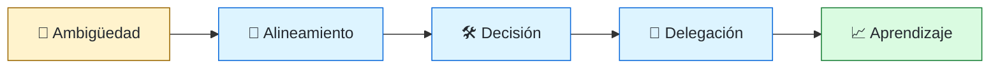
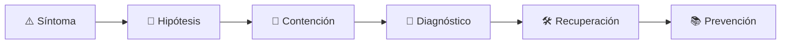

# 🧭 Staff / Principal Engineer y Technical Lead
<!-- role-visual:start -->

**La guía conecta trabajo real, decisiones, clases concretas y evidencia defendible.**

<!-- role-visual:end -->

> Multiplica la capacidad técnica de varios equipos mediante dirección, decisiones,
> estándares y mentoring; su impacto no se mide por apropiarse de todo el código.
>
> **Entrada habitual:** senior experimentado · **Foco:** influencia y sistemas
> sociotécnicos · **Evidencia central:** mejora sostenible que otros equipos adoptan

## 🧭 Qué es y por qué importa

Tech Lead suele liderar la ejecución técnica de un equipo o iniciativa. Staff y
Principal son niveles individuales contributor con alcance creciente entre equipos,
dominios u organización. Los títulos no son sinónimos, pero comparten una idea: resolver
problemas ambiguos y aumentar la calidad de decisiones ajenas sin autoridad jerárquica.

## 🗓️ Un día en el puesto

- clarificar una iniciativa transversal y sus riesgos;
- facilitar un RFC o architecture review;
- desbloquear a un equipo sin tomarle el ownership;
- alinear contratos o prácticas entre dominios;
- mentorar, revisar y comunicar hacia audiencias distintas;
- observar resultados y retirar una recomendación que no funcionó.

## ✅ Responsabilidades y límites

- Crea contexto, principios y mecanismos de decisión.
- Mantiene cercanía con implementación y operación.
- No es el aprobador universal ni el héroe que resuelve todo.
- No usa “estándares” para congelar experimentación.
- No reemplaza al Engineering Manager en desempeño y personas.

## 🧠 Qué necesitas saber

- arquitectura, calidad, seguridad, operación y evolución;
- discovery, economía, priorización y gestión de riesgo;
- RFC/ADR, revisión de diseño y comunicación ejecutiva;
- Conway, Team Topologies, ownership y carga cognitiva;
- mentoring, negociación, conflicto y decisiones bajo incertidumbre;
- incident leadership y aprendizaje organizacional.

## 📚 Tu ruta en el programa

1. Parte 00 y partes 10–17 para responsabilidad, producto y colaboración.
2. Partes 24–29 para decisiones de diseño y sistemas complejos.
3. Partes 30–36 para calidad, seguridad, entrega, operación y evolución.
4. [Parte 37 — Gestión, liderazgo y práctica profesional](../classes/part-37-gestion-liderazgo-y-practica-profesional/README.md).
5. Partes 38–39 para gobernar adopción de IA y agentes.

<!-- role-depth:start -->
## 🗺️ Sistema profesional del rol

El gráfico no representa una cascada rígida. Muestra el bucle profesional que este rol
debe poder recorrer: comprender el contexto, tomar una decisión, intervenir, observar
el efecto y convertir lo aprendido en una mejora. En **🧭 Staff / Principal Engineer y Technical Lead**, saltar directamente a
la herramienta suele ocultar el problema, mientras que terminar sin evidencia deja la
decisión en una opinión. La misión concreta es: Multiplica la capacidad técnica de varios equipos mediante dirección, decisiones, estándares y mentoring; su impacto no se mide por apropiarse de todo el código. Cada transición
debe conservar supuestos, responsables y una forma de volver atrás.

<table>
<tr>
<td valign="top" width="50%">

### 🎯 Responde por

- decisiones propias de la familia **Liderazgo técnico**;
- el resultado observable, no sólo la actividad ejecutada;
- límites, riesgos, operación y deuda residual de su intervención;
- evidencia que otra persona pueda revisar o reproducir.

</td>
<td valign="top" width="50%">

### 🤝 Coordina con

- [🏛️ Software Architect](software-architect.md); [👥 Engineering Manager](engineering-manager.md); [🧭 CTO / Dirección de Tecnología](cto.md);
- producto y personas usuarias cuando cambia una tarea o outcome;
- seguridad, privacidad, accesibilidad y operación según el riesgo;
- quienes mantendrán el sistema después de la entrega.

</td>
</tr>
</table>

El título no concede autoridad automática. El alcance real depende del equipo, la
industria y la criticidad. Esta guía describe un recorrido desde **senior → principal**, pero una
vacante se evalúa por las decisiones que permite tomar, los sistemas que pone bajo
responsabilidad y la evidencia exigida, no por el nombre del cargo.

## 🧱 Partes y clases asociadas

La ruta distingue **parte** —unidad curricular con una capacidad acumulativa— de
**clase asociada** —punto concreto donde se estudia un mecanismo o una decisión. Las
clases siguientes forman el núcleo; no eliminan los prerrequisitos indicados en sus
propias páginas ni convierten en opcional la base común.

| Orden | Parte del programa | Clases clave | Por qué entra en esta ruta | Evidencia de transferencia |
| ---: | --- | --- | --- | --- |
| 1 | [Parte 15 · Procesos, planificación y estimación](../classes/part-15-procesos-planificacion-y-estimacion/README.md) | [SE-186 · Planificación de entregas y gestión de dependencias](../classes/part-15-procesos-planificacion-y-estimacion/se-186-planificacion-de-entregas-y-gestion-de-dependencias/README.md) [SE-187 · Riesgos, supuestos, issues y decisiones](../classes/part-15-procesos-planificacion-y-estimacion/se-187-riesgos-supuestos-issues-y-decisiones/README.md) [SE-190 · Retrospectivas y mejora del sistema de trabajo](../classes/part-15-procesos-planificacion-y-estimacion/se-190-retrospectivas-y-mejora-del-sistema-de-trabajo/README.md) | Profundiza **flujo, estimación y planificación incierta** desde la responsabilidad del rol. | Plan probabilístico adaptable. |
| 2 | [Parte 25 · Arquitectura de software y dominio](../classes/part-25-arquitectura-de-software-y-dominio/README.md) | [SE-309 · Trade-offs, ADR y evaluación de alternativas](../classes/part-25-arquitectura-de-software-y-dominio/se-309-trade-offs-adr-y-evaluacion-de-alternativas/README.md) [SE-310 · Arquitectura socio-técnica y límites de equipo](../classes/part-25-arquitectura-de-software-y-dominio/se-310-arquitectura-socio-tecnica-y-limites-de-equipo/README.md) [SE-311 · Taller: revisar una arquitectura contra escenarios](../classes/part-25-arquitectura-de-software-y-dominio/se-311-taller-revisar-una-arquitectura-contra-escenarios/README.md) | Profundiza **arquitectura, dominio y atributos de calidad** desde la responsabilidad del rol. | Arquitectura defendible con ADR. |
| 3 | [Parte 35 · Observabilidad, SRE e incidentes](../classes/part-35-observabilidad-sre-e-incidentes/README.md) | [SE-428 · Gestión de incidentes y comunicación](../classes/part-35-observabilidad-sre-e-incidentes/se-428-gestion-de-incidentes-y-comunicacion/README.md) [SE-429 · Postmortems sin culpa y aprendizaje](../classes/part-35-observabilidad-sre-e-incidentes/se-429-postmortems-sin-culpa-y-aprendizaje/README.md) [SE-430 · Continuidad, disaster recovery y ejercicios](../classes/part-35-observabilidad-sre-e-incidentes/se-430-continuidad-disaster-recovery-y-ejercicios/README.md) | Profundiza **observabilidad, SRE e incidentes** desde la responsabilidad del rol. | Incidente diagnosticado y recuperado. |
| 4 | [Parte 37 · Gestión, liderazgo y práctica profesional](../classes/part-37-gestion-liderazgo-y-practica-profesional/README.md) | [SE-445 · Liderazgo técnico sin autoridad formal](../classes/part-37-gestion-liderazgo-y-practica-profesional/se-445-liderazgo-tecnico-sin-autoridad-formal/README.md) [SE-448 · Mentoría, feedback y crecimiento](../classes/part-37-gestion-liderazgo-y-practica-profesional/se-448-mentoria-feedback-y-crecimiento/README.md) [SE-455 · Taller: conducir una revisión de decisión difícil](../classes/part-37-gestion-liderazgo-y-practica-profesional/se-455-taller-conducir-una-revision-de-decision-dificil/README.md) | Profundiza **liderazgo, organización y decisiones** desde la responsabilidad del rol. | Propuesta defendida ante conflicto. |

**Cómo recorrerla.** Empieza por [SE-186](../classes/part-15-procesos-planificacion-y-estimacion/se-186-planificacion-de-entregas-y-gestion-de-dependencias/README.md) para fijar el
primer mecanismo, usa [SE-428](../classes/part-35-observabilidad-sre-e-incidentes/se-428-gestion-de-incidentes-y-comunicacion/README.md) para integrar el
centro de la especialidad y llega a [SE-455](../classes/part-37-gestion-liderazgo-y-practica-profesional/se-455-taller-conducir-una-revision-de-decision-dificil/README.md) cuando ya
puedas explicar cómo detectar y recuperar un fallo. Una clase se considera estudiada
sólo cuando su concepto cambia una decisión y deja evidencia; abrir todos los enlaces
no constituye competencia.

> [!IMPORTANT]
> El mapa expresa el currículo previsto. Las Partes 00–01 están desarrolladas; las
> posteriores conservan borradores o estructuras que deben superar revisión
> cualitativa. Esta ruta no declara terminadas esas clases ni reemplaza el
> [roadmap](../ROADMAP.md).

## ⚖️ Decisiones y trade-offs que debes defender

| Decisión recurrente | Criterio profesional | Evidencia mínima antes de defenderla |
| --- | --- | --- |
| **Decidir o facilitar** | Usar autoridad técnica sólo cuando riesgo y tiempo lo requieren. | Decision record y participación adecuada. |
| **Consistencia o autonomía** | Definir principios interfaces y ownership sin microgestión. | Resultados entre equipos y excepciones. |
| **Deuda o entrega** | Hacer visible interés riesgo y oportunidad para secuenciar. | Opciones y criterio de revisión. |

La calidad de una decisión no se juzga porque coincida con una herramienta popular.
Debe hacer explícitos contexto, restricciones, alternativas descartadas, coste de
cambio y condición de revisión. En especial, **Decidir o facilitar**, **Consistencia o autonomía**
y **Deuda o entrega** cambian de respuesta cuando cambia el riesgo. Una solución
correcta en un prototipo puede ser irresponsable en un sistema regulado; una solución
robusta para un servicio crítico puede ser desperdicio en una herramienta interna.

## 🚨 Escenario profesional: Dos equipos bloquean una migración por incentivos opuestos

**Síntoma.** Cada uno optimiza su servicio y nadie responde por el flujo completo. La respuesta madura evita convertir la primera
correlación en causa y conserva evidencia antes de modificar el sistema.

1. **Detectar y delimitar:** identifica quién o qué está afectado, desde cuándo y qué
   cambió. Conserva timestamps, versiones, entradas y señales suficientes para no
   destruir la escena al intentar arreglarla.
2. **Investigar:** Mapear outcome dependencias riesgo autoridad alternativas y coste de espera. Formula al menos dos hipótesis rivales
   y define qué observación refutaría cada una.
3. **Contener:** reduce blast radius y daño sin prometer una corrección todavía. La
   contención debe ser reversible, visible y compatible con las obligaciones del
   sistema.
4. **Recuperar:** Facilitar decisión asignar owners etapas y revisión sin imponer falsa unanimidad. Verifica la tarea completa, no sólo que un
   proceso volvió a estar verde.
5. **Aprender:** añade una regresión, señal o control que detecte la misma clase de
   fallo. Documenta qué deuda permanece y quién revisará la acción.

El escenario evalúa método además de resultado. Una recuperación rápida que borra la
causa, oculta pérdida de datos o deja al equipo sin mecanismo preventivo no demuestra
dominio del rol.

## 📊 Señales útiles y límites de las métricas

| Señal | Qué ayuda a observar | Trampa que debe evitarse |
| --- | --- | --- |
| **Decisiones reabiertas** | Claridad insuficiente de contexto autoridad o evidencia. | Evitar debate contando reuniones. |
| **Dependencias entre equipos** | Esperas y handoffs que bloquean outcomes. | Culpar velocidad individual. |
| **Crecimiento de referentes** | Personas que asumen decisiones con soporte decreciente. | Medir mentorías realizadas. |

Ninguna señal debe convertirse en ranking individual. Combina tendencia cuantitativa,
muestreo de casos, feedback cualitativo y contexto de carga. Declara ventana,
denominador, fuente, exclusiones y quién puede actuar sobre el resultado. Si una
métrica mejora mientras el outcome o el riesgo empeoran, el sistema está optimizando
el indicador y no el trabajo.

## 🧩 Proyecto integrador del rol: Programa técnico multiequipo

**Propósito:** conducir una decisión transversal desde RFC hasta adopción y aprendizaje. El resultado esperado es **contexto opciones ADR/RFC mapa de stakeholders plan incremental métricas riesgos mentoring y retrospectiva**.

Entrega un expediente revisable con estas piezas:

1. **Contexto y alcance:** usuario, sistema, restricción, supuestos, fuera de alcance y
   criterio de no éxito.
2. **Decisión:** al menos dos alternativas reales, trade-offs, coste de reversión y un
   ADR o memo que indique cuándo revisar la elección.
3. **Artefacto principal:** una implementación, modelo, flujo o política coherente con
   las clases núcleo; no una captura aislada ni una presentación sin mecanismo.
4. **Fallo controlado:** introduce una condición adversa relacionada con el escenario
   anterior y conserva el resultado observado, sin inventar una ejecución.
5. **Verificación:** prueba, rúbrica, revisión o medición que pueda fallar y que conecte
   directamente con el resultado profesional.
6. **Operación y salida:** telemetría, recuperación, mantenimiento, deprecación o retiro
   según corresponda; incluye límites y deuda residual.

**Criterio de aceptación:** otra persona puede reconstruir el razonamiento, reproducir
la comprobación y distinguir claramente qué quedó demostrado de lo que sólo se propone.
El proyecto no se aprueba por cantidad de archivos ni por utilizar una marca concreta.

## 📈 Dominio esperado por alcance

| Alcance | Qué resuelve | Qué evidencia su autonomía |
| --- | --- | --- |
| **Inicial** | ejecuta una tarea acotada con criterios y acompañamiento | reproduce el caso, pregunta por supuestos y entrega evidencia legible |
| **Intermedio** | decide dentro de un componente o flujo conocido | compara alternativas, prueba fallos previsibles y coordina dependencias |
| **Senior** | conduce problemas ambiguos que cruzan sistemas o equipos | hace explícito el riesgo, diseña recuperación y mejora el mecanismo de trabajo |
| **Staff / Lead** | cambia capacidades compartidas y decisiones de largo plazo | multiplica criterio, define guardrails, mide adopción y conserva opciones futuras |

Progresar no significa alejarse de la práctica. Significa aumentar ambigüedad, horizonte,
blast radius y responsabilidad por consecuencias. La persona senior todavía debe poder
explicar el mecanismo; la persona Staff además crea condiciones para que otros lo
operen sin depender de ella.

## 🗓️ Plan de práctica 30 · 60 · 90 días

- **Días 1–30 — comprender y reproducir.** Estudia las primeras clases de cada parte,
  reproduce un caso pequeño y escribe un mapa de responsabilidades. El entregable es
  una baseline con preguntas abiertas, no una transformación prematura.
- **Días 31–60 — intervenir y fallar con control.** Construye el artefacto central,
  introduce el escenario de fallo y mide el comportamiento. Revisa el trabajo con una
  persona de una ruta vecina para descubrir supuestos de frontera.
- **Días 61–90 — operar y transferir.** Ejecuta recuperación, corrige la causa, publica
  runbook o guía de uso y presenta la decisión con trade-offs. Termina con una
  retrospectiva que separe resultado, evidencia, límites y siguiente inversión.

Este plan es una secuencia de práctica, no una promesa de empleabilidad en noventa días.
La experiencia previa, el dominio y el acceso a sistemas reales cambian el tiempo
necesario.

## 🎤 Preguntas para revisión o entrevista

1. ¿En qué contexto elegirías **Decidir o facilitar** y qué evidencia te haría cambiar?
2. ¿Cómo distinguirías síntoma, causa y daño en el escenario **Dos equipos bloquean una migración por incentivos opuestos**?
3. ¿Qué clase asociada usarías para diseñar el mecanismo y cuál para verificarlo?
4. ¿Qué parte de **Programa técnico multiequipo** no automatizarías todavía y por qué?
5. ¿Qué métrica podría mejorar mientras el sistema empeora y qué guardrail añadirías?
6. ¿Dónde termina la autoridad de este rol y cuándo debe escalar o pedir revisión?

Una respuesta fuerte usa un caso, reconoce incertidumbre y propone una comprobación.
Nombrar una herramienta sin explicar mecanismo, fallo y límite no demuestra la
competencia.

## 🔗 Fuentes primarias y oficiales

- [SWEBOK Guide v4.0a](https://www.computer.org/education/bodies-of-knowledge/software-engineering) — **IEEE Computer Society**. Se usa como referencia primaria u oficial; la guía no sustituye la fuente.
- [DORA software delivery performance metrics](https://dora.dev/guides/dora-metrics/) — **Google Cloud**. Se usa como referencia primaria u oficial; la guía no sustituye la fuente.
- [ACM Code of Ethics and Professional Conduct](https://www.acm.org/code-of-ethics) — **ACM**. Se usa como referencia primaria u oficial; la guía no sustituye la fuente.

Las fuentes orientan principios, vocabulario y prácticas; no convierten la guía en una
certificación ni sustituyen la documentación específica del sistema, la jurisdicción
o la tecnología utilizada.
<!-- role-depth:end -->

## 🧪 Evidencia de portafolio

- RFC transversal con feedback y decisión final trazable;
- programa de migración ejecutado por varios equipos;
- estándar mínimo con escape y mecanismo de evolución;
- mentoring con transferencia visible de ownership;
- postmortem o iniciativa que elimina una clase de fallos;
- narrativa ejecutiva que conecta inversión técnica con riesgo o valor.

## 📈 Progresión

Senior → Tech Lead/Staff → Senior Staff/Principal → Distinguished/Fellow donde exista.
La progresión no es universal: algunas empresas separan nivel y rol temporal. El
criterio útil es alcance, complejidad, autonomía e impacto multiplicador.

## ⚠️ Mitos frecuentes

- “Staff escribe menos código.” Puede escribir menos volumen, pero valida decisiones críticas.
- “Liderar es decidir por otros.” Liderar también crea condiciones para decisiones locales.
- “Principal equivale a architect.” Pueden solaparse; mandato y alcance importan más.
- “La influencia se logra con documentos largos.” Sin adopción y feedback son archivos huérfanos.

## 🚀 Siguientes pasos

1. Lidera una decisión transversal con RFC y alternativas reales.
2. Mide si equipos consumidores entienden y adoptan el resultado.
3. Transfiere ownership explícitamente.
4. Revisa la decisión después de operar y publica lo aprendido.

---

[⬅️ Volver a las rutas](README.md) · [🏠 Inicio del programa](../README.md)
