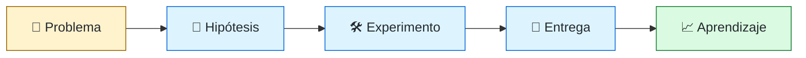
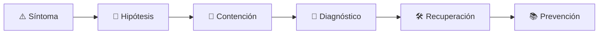

# 🧭 Technical Product Engineer
<!-- role-visual:start -->

**La guía conecta trabajo real, decisiones, clases concretas y evidencia defendible.**

<!-- role-visual:end -->

> Une discovery, economía, experiencia y factibilidad técnica para convertir problemas
> inciertos en experimentos y capacidades de producto sostenibles.
>
> **Entrada habitual:** semi-senior/senior · **Foco:** producto con profundidad técnica
> · **Evidencia central:** decisión de producto validada y operable

## 🧭 Qué es y por qué importa

Este perfil aparece como Product Engineer, Technical Product Manager con capacidad de
prototipado o ingeniero orientado a producto. No es un título uniforme. Su rasgo común
es reducir la distancia entre descubrir valor y construirlo: puede probar hipótesis,
entender restricciones técnicas y medir outcomes sin confundir velocidad con aprendizaje.

## 🗓️ Un día en el puesto

- entrevistar usuarios y sintetizar evidencia;
- formular una hipótesis y sus guardrails;
- prototipar un flujo o experimento técnico;
- negociar alcance con diseño e ingeniería;
- analizar métricas y resultados cualitativos;
- decidir continuar, cambiar o detener una inversión.

## ✅ Responsabilidades y límites

- Conecta necesidad, requisito, implementación y resultado.
- Explicita supuestos y coste de oportunidad.
- No usa prototipos como código de producción sin revisión.
- No decide arquitectura profunda sin quienes la operarán.
- No convierte correlación en causalidad ni métricas en objetivos ciegos.

## 🧠 Qué necesitas saber

- discovery, entrevistas, prototipos y priorización;
- requisitos, aceptación, trazabilidad y cambios;
- TCO, ROI, build-vs-buy y experimentación;
- fundamentos de software, APIs, datos y experiencia;
- feature flags, telemetría, A/B testing y guardrails;
- comunicación, negociación y decisiones bajo incertidumbre.

## 📚 Tu ruta en el programa

1. Parte 00 y partes 05–09 para lenguaje técnico suficiente.
2. [Parte 10 — Descubrimiento y estrategia de producto](../classes/part-10-descubrimiento-y-estrategia-de-producto/README.md) y partes 11–14 para economía, requisitos y UX.
3. Partes 15–17 para planificación, colaboración y documentación.
4. Partes 19–20 para comprender superficies y contratos.
5. Partes 24–25 y 31 para diseño, arquitectura, calidad y resiliencia.
6. Parte 37 y partes 38–39 para liderazgo y experimentación asistida con IA.

<!-- role-depth:start -->
## 🗺️ Sistema profesional del rol

El gráfico no representa una cascada rígida. Muestra el bucle profesional que este rol
debe poder recorrer: comprender el contexto, tomar una decisión, intervenir, observar
el efecto y convertir lo aprendido en una mejora. En **🧭 Technical Product Engineer**, saltar directamente a
la herramienta suele ocultar el problema, mientras que terminar sin evidencia deja la
decisión en una opinión. La misión concreta es: Une discovery, economía, experiencia y factibilidad técnica para convertir problemas inciertos en experimentos y capacidades de producto sostenibles. Cada transición
debe conservar supuestos, responsables y una forma de volver atrás.

<table>
<tr>
<td valign="top" width="50%">

### 🎯 Responde por

- decisiones propias de la familia **Producto técnico**;
- el resultado observable, no sólo la actividad ejecutada;
- límites, riesgos, operación y deuda residual de su intervención;
- evidencia que otra persona pueda revisar o reproducir.

</td>
<td valign="top" width="50%">

### 🤝 Coordina con

- [🧾 Requirements Engineer / Business Systems Analyst](requirements-engineer.md); [🧩 Solutions Architect](solutions-architect.md); [💸 FinOps Engineer](finops-engineer.md);
- producto y personas usuarias cuando cambia una tarea o outcome;
- seguridad, privacidad, accesibilidad y operación según el riesgo;
- quienes mantendrán el sistema después de la entrega.

</td>
</tr>
</table>

El título no concede autoridad automática. El alcance real depende del equipo, la
industria y la criticidad. Esta guía describe un recorrido desde **semi-senior → principal**, pero una
vacante se evalúa por las decisiones que permite tomar, los sistemas que pone bajo
responsabilidad y la evidencia exigida, no por el nombre del cargo.

## 🧱 Partes y clases asociadas

La ruta distingue **parte** —unidad curricular con una capacidad acumulativa— de
**clase asociada** —punto concreto donde se estudia un mecanismo o una decisión. Las
clases siguientes forman el núcleo; no eliminan los prerrequisitos indicados en sus
propias páginas ni convierten en opcional la base común.

| Orden | Parte del programa | Clases clave | Por qué entra en esta ruta | Evidencia de transferencia |
| ---: | --- | --- | --- | --- |
| 1 | [Parte 10 · Descubrimiento y estrategia de producto](../classes/part-10-descubrimiento-y-estrategia-de-producto/README.md) | [SE-121 · Problemas, síntomas, necesidades y oportunidades](../classes/part-10-descubrimiento-y-estrategia-de-producto/se-121-problemas-sintomas-necesidades-y-oportunidades/README.md) [SE-124 · Hipótesis, supuestos y preguntas críticas](../classes/part-10-descubrimiento-y-estrategia-de-producto/se-124-hipotesis-supuestos-y-preguntas-criticas/README.md) [SE-132 · Proyecto: product brief respaldado por evidencia](../classes/part-10-descubrimiento-y-estrategia-de-producto/se-132-proyecto-product-brief-respaldado-por-evidencia/README.md) | Profundiza **discovery, usuarios, hipótesis y valor** desde la responsabilidad del rol. | Dossier de problema y decisión. |
| 2 | [Parte 11 · Economía, métricas y decisiones de producto](../classes/part-11-economia-metricas-y-decisiones-de-producto/README.md) | [SE-134 · Costos de construcción, operación y oportunidad](../classes/part-11-economia-metricas-y-decisiones-de-producto/se-134-costos-de-construccion-operacion-y-oportunidad/README.md) [SE-138 · Experimentos, sesgos y causalidad básica](../classes/part-11-economia-metricas-y-decisiones-de-producto/se-138-experimentos-sesgos-y-causalidad-basica/README.md) [SE-144 · Proyecto: caso de viabilidad técnico-económica](../classes/part-11-economia-metricas-y-decisiones-de-producto/se-144-proyecto-caso-de-viabilidad-tecnico-economica/README.md) | Profundiza **economía, métricas y experimentación** desde la responsabilidad del rol. | Caso económico con sensibilidad. |
| 3 | [Parte 12 · Ingeniería de requisitos](../classes/part-12-ingenieria-de-requisitos/README.md) | [SE-146 · Requisitos funcionales y reglas de negocio](../classes/part-12-ingenieria-de-requisitos/se-146-requisitos-funcionales-y-reglas-de-negocio/README.md) [SE-149 · Criterios de aceptación y ejemplos](../classes/part-12-ingenieria-de-requisitos/se-149-criterios-de-aceptacion-y-ejemplos/README.md) [SE-154 · Ambigüedad, contradicción e incompletitud](../classes/part-12-ingenieria-de-requisitos/se-154-ambiguedad-contradiccion-e-incompletitud/README.md) | Profundiza **requisitos, restricciones y trazabilidad** desde la responsabilidad del rol. | Baseline de requisitos revisable. |
| 4 | [Parte 38 · Desarrollo de software asistido por IA](../classes/part-38-desarrollo-de-software-asistido-por-ia/README.md) | [SE-461 · Prototipado, scaffolding y exploración de alternativas](../classes/part-38-desarrollo-de-software-asistido-por-ia/se-461-prototipado-scaffolding-y-exploracion-de-alternativas/README.md) [SE-465 · Evals de exactitud, utilidad, costo y latencia](../classes/part-38-desarrollo-de-software-asistido-por-ia/se-465-evals-de-exactitud-utilidad-costo-y-latencia/README.md) [SE-468 · Proyecto: cambio real con trazabilidad y revisión humana](../classes/part-38-desarrollo-de-software-asistido-por-ia/se-468-proyecto-cambio-real-con-trazabilidad-y-revision-humana/README.md) | Profundiza **ingeniería asistida por IA y evaluaciones** desde la responsabilidad del rol. | Cambio asistido con trazabilidad. |

**Cómo recorrerla.** Empieza por [SE-121](../classes/part-10-descubrimiento-y-estrategia-de-producto/se-121-problemas-sintomas-necesidades-y-oportunidades/README.md) para fijar el
primer mecanismo, usa [SE-146](../classes/part-12-ingenieria-de-requisitos/se-146-requisitos-funcionales-y-reglas-de-negocio/README.md) para integrar el
centro de la especialidad y llega a [SE-468](../classes/part-38-desarrollo-de-software-asistido-por-ia/se-468-proyecto-cambio-real-con-trazabilidad-y-revision-humana/README.md) cuando ya
puedas explicar cómo detectar y recuperar un fallo. Una clase se considera estudiada
sólo cuando su concepto cambia una decisión y deja evidencia; abrir todos los enlaces
no constituye competencia.

> [!IMPORTANT]
> El mapa expresa el currículo previsto. Las Partes 00–04 están desarrolladas; las
> posteriores conservan borradores o estructuras que deben superar revisión
> cualitativa. Esta ruta no declara terminadas esas clases ni reemplaza el
> [roadmap](../ROADMAP.md).

## ⚖️ Decisiones y trade-offs que debes defender

| Decisión recurrente | Criterio profesional | Evidencia mínima antes de defenderla |
| --- | --- | --- |
| **Descubrir o construir** | Reducir primero la incertidumbre que puede invalidar inversión. | Evidencia de usuario y criterio de no éxito. |
| **Métrica o narrativa** | Combinar señal cuantitativa con mecanismo causal y contexto. | Guardrails y análisis de sesgo. |
| **Prototipo o producto** | Declarar qué riesgo prueba cada artefacto y qué no. | Decisión posterior explícita. |

La calidad de una decisión no se juzga porque coincida con una herramienta popular.
Debe hacer explícitos contexto, restricciones, alternativas descartadas, coste de
cambio y condición de revisión. En especial, **Descubrir o construir**, **Métrica o narrativa**
y **Prototipo o producto** cambian de respuesta cuando cambia el riesgo. Una solución
correcta en un prototipo puede ser irresponsable en un sistema regulado; una solución
robusta para un servicio crítico puede ser desperdicio en una herramienta interna.

## 🚨 Escenario profesional: Una función aumenta uso pero empeora el resultado del cliente

**Síntoma.** La métrica principal captura actividad y omite guardrail. La respuesta madura evita convertir la primera
correlación en causa y conserva evidencia antes de modificar el sistema.

1. **Detectar y delimitar:** identifica quién o qué está afectado, desde cuándo y qué
   cambió. Conserva timestamps, versiones, entradas y señales suficientes para no
   destruir la escena al intentar arreglarla.
2. **Investigar:** Revisar hipótesis segmento instrumentación causalidad daño y alternativas. Formula al menos dos hipótesis rivales
   y define qué observación refutaría cada una.
3. **Contener:** reduce blast radius y daño sin prometer una corrección todavía. La
   contención debe ser reversible, visible y compatible con las obligaciones del
   sistema.
4. **Recuperar:** Pausar rollout proteger usuarios y rediseñar experimento. Verifica la tarea completa, no sólo que un
   proceso volvió a estar verde.
5. **Aprender:** añade una regresión, señal o control que detecte la misma clase de
   fallo. Documenta qué deuda permanece y quién revisará la acción.

El escenario evalúa método además de resultado. Una recuperación rápida que borra la
causa, oculta pérdida de datos o deja al equipo sin mecanismo preventivo no demuestra
dominio del rol.

## 📊 Señales útiles y límites de las métricas

| Señal | Qué ayuda a observar | Trampa que debe evitarse |
| --- | --- | --- |
| **Outcome de usuario** | Cambio de capacidad o resultado no actividad interna. | Celebrar features entregadas. |
| **Tiempo hasta aprendizaje** | Velocidad para invalidar una suposición importante. | Hacer experimentos sin decisión. |
| **Costo de demora** | Valor perdido y opciones cerradas por secuencia. | Inventar precisión monetaria. |

Ninguna señal debe convertirse en ranking individual. Combina tendencia cuantitativa,
muestreo de casos, feedback cualitativo y contexto de carga. Declara ventana,
denominador, fuente, exclusiones y quién puede actuar sobre el resultado. Si una
métrica mejora mientras el outcome o el riesgo empeoran, el sistema está optimizando
el indicador y no el trabajo.

## 🧩 Proyecto integrador del rol: Decisión de producto técnico

**Propósito:** pasar de problema ambiguo a experimento y entrega evaluable. El resultado esperado es **research brief mapa de supuestos prototipo métricas guardrails factibilidad TCO y memo de decisión**.

Entrega un expediente revisable con estas piezas:

1. **Contexto y alcance:** usuario, sistema, restricción, supuestos, fuera de alcance y
   criterio de no éxito.
2. **Decisión:** al menos dos alternativas reales, trade-offs, coste de reversión y un
   ADR o memo que indique cuándo revisar la elección.
3. **Artefacto principal:** una implementación, modelo, flujo o política coherente con
   las clases núcleo; no una captura aislada ni una presentación sin mecanismo.
4. **Fallo controlado:** introduce una condición adversa relacionada con el escenario
   anterior y conserva el resultado observado, sin inventar una ejecución.
5. **Verificación:** prueba, rúbrica, revisión o medición que pueda fallar y que conecte
   directamente con el resultado profesional.
6. **Operación y salida:** telemetría, recuperación, mantenimiento, deprecación o retiro
   según corresponda; incluye límites y deuda residual.

**Criterio de aceptación:** otra persona puede reconstruir el razonamiento, reproducir
la comprobación y distinguir claramente qué quedó demostrado de lo que sólo se propone.
El proyecto no se aprueba por cantidad de archivos ni por utilizar una marca concreta.

## 📈 Dominio esperado por alcance

| Alcance | Qué resuelve | Qué evidencia su autonomía |
| --- | --- | --- |
| **Inicial** | ejecuta una tarea acotada con criterios y acompañamiento | reproduce el caso, pregunta por supuestos y entrega evidencia legible |
| **Intermedio** | decide dentro de un componente o flujo conocido | compara alternativas, prueba fallos previsibles y coordina dependencias |
| **Senior** | conduce problemas ambiguos que cruzan sistemas o equipos | hace explícito el riesgo, diseña recuperación y mejora el mecanismo de trabajo |
| **Staff / Lead** | cambia capacidades compartidas y decisiones de largo plazo | multiplica criterio, define guardrails, mide adopción y conserva opciones futuras |

Progresar no significa alejarse de la práctica. Significa aumentar ambigüedad, horizonte,
blast radius y responsabilidad por consecuencias. La persona senior todavía debe poder
explicar el mecanismo; la persona Staff además crea condiciones para que otros lo
operen sin depender de ella.

## 🗓️ Plan de práctica 30 · 60 · 90 días

- **Días 1–30 — comprender y reproducir.** Estudia las primeras clases de cada parte,
  reproduce un caso pequeño y escribe un mapa de responsabilidades. El entregable es
  una baseline con preguntas abiertas, no una transformación prematura.
- **Días 31–60 — intervenir y fallar con control.** Construye el artefacto central,
  introduce el escenario de fallo y mide el comportamiento. Revisa el trabajo con una
  persona de una ruta vecina para descubrir supuestos de frontera.
- **Días 61–90 — operar y transferir.** Ejecuta recuperación, corrige la causa, publica
  runbook o guía de uso y presenta la decisión con trade-offs. Termina con una
  retrospectiva que separe resultado, evidencia, límites y siguiente inversión.

Este plan es una secuencia de práctica, no una promesa de empleabilidad en noventa días.
La experiencia previa, el dominio y el acceso a sistemas reales cambian el tiempo
necesario.

## 🎤 Preguntas para revisión o entrevista

1. ¿En qué contexto elegirías **Descubrir o construir** y qué evidencia te haría cambiar?
2. ¿Cómo distinguirías síntoma, causa y daño en el escenario **Una función aumenta uso pero empeora el resultado del cliente**?
3. ¿Qué clase asociada usarías para diseñar el mecanismo y cuál para verificarlo?
4. ¿Qué parte de **Decisión de producto técnico** no automatizarías todavía y por qué?
5. ¿Qué métrica podría mejorar mientras el sistema empeora y qué guardrail añadirías?
6. ¿Dónde termina la autoridad de este rol y cuándo debe escalar o pedir revisión?

Una respuesta fuerte usa un caso, reconoce incertidumbre y propone una comprobación.
Nombrar una herramienta sin explicar mecanismo, fallo y límite no demuestra la
competencia.

## 🔗 Fuentes primarias y oficiales

- [ISO/IEC/IEEE 29148:2018](https://www.iso.org/standard/72089.html) — **ISO**. Se usa como referencia primaria u oficial; la guía no sustituye la fuente.
- [AI Risk Management Framework](https://www.nist.gov/itl/ai-risk-management-framework) — **NIST**. Se usa como referencia primaria u oficial; la guía no sustituye la fuente.
- [ACM Code of Ethics and Professional Conduct](https://www.acm.org/code-of-ethics) — **ACM**. Se usa como referencia primaria u oficial; la guía no sustituye la fuente.

Las fuentes orientan principios, vocabulario y prácticas; no convierten la guía en una
certificación ni sustituyen la documentación específica del sistema, la jurisdicción
o la tecnología utilizada.
<!-- role-depth:end -->

## 🧪 Evidencia de portafolio

- dossier de discovery con hechos, inferencias y preguntas abiertas;
- prototipo y guion de prueba con resultados;
- requisito trazado a métrica y criterio de aceptación;
- análisis build-vs-buy con TCO y sensibilidad;
- experimento con hipótesis, guardrails y decisión posterior;
- ADR/RFC que conecta decisión técnica con outcome.

## 📈 Progresión

Software/Product Engineer → Senior Product Engineer → Product Tech Lead, Staff Product
Engineer o transición a Product Management técnico. La progresión aumenta la calidad
de apuestas y la capacidad de alinear funciones, no la cantidad de funcionalidades.

## ⚠️ Mitos frecuentes

- “Product Engineer hace de todo.” Debe conservar límites y pedir especialización.
- “Discovery termina al empezar desarrollo.” La evidencia continúa en producción.
- “Más uso significa más valor.” Puede reflejar fricción, dependencia o métrica mal elegida.
- “El prototipo demuestra factibilidad productiva.” Solo reduce una incertidumbre específica.

## 🚀 Siguientes pasos

1. Elige un problema y separa evidencia de supuestos.
2. Diseña el experimento mínimo con criterio de detener.
3. Estima coste total, no solo desarrollo inicial.
4. Conecta el aprendizaje con un requisito y una decisión técnica revisable.

---

[⬅️ Volver a las rutas](README.md) · [🏠 Inicio del programa](../README.md)
