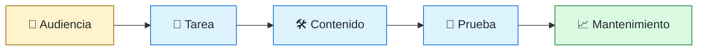
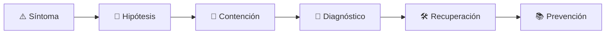

# ✍️ Technical Writer / Documentation Engineer
<!-- role-visual:start -->

**La guía conecta trabajo real, decisiones, clases concretas y evidencia defendible.**

<!-- role-visual:end -->

> Diseña conocimiento técnico encontrable, verificable y mantenible para que otras
> personas puedan usar, operar y cambiar sistemas sin depender de memoria tácita.
>
> **Entrada habitual:** junior/semi-senior · **Foco:** arquitectura de información y docs-as-code
> · **Evidencia central:** documentación probada mediante tareas reales

## 🧭 Qué es y por qué importa

La documentación es una interfaz del sistema. Este rol investiga audiencias y tareas,
separa tutorial, how-to, explicación y referencia, y conecta cambios de código con la
actualización del conocimiento, incluyendo límites y fecha de validez.

## 🗓️ Un día en el puesto

- observar dónde una persona no encuentra o interpreta información;
- probar instrucciones en un entorno limpio;
- editar API reference, tutorial, runbook o ADR;
- mejorar navegación, glosario y accesibilidad;
- automatizar enlaces, ejemplos y ownership.

## ✅ Responsabilidades y límites

- Responde por utilidad, precisión, estructura y mantenimiento documental.
- Trabaja con especialistas; no inventa comportamiento ausente.
- No mide calidad por cantidad de páginas.
- No trata un texto generado como correcto sin validación técnica y de tarea.

## 🧠 Qué necesitas saber

Análisis de audiencia y tareas, escritura técnica, arquitectura de información,
docs-as-code, Markdown, diagramas, ejemplos, APIs, control de versiones, búsqueda,
accesibilidad, localización, testing documental y gobierno de conocimiento.

## 📚 Tu ruta en el programa

1. Partes 00, 04–05 y 08–10 para sistemas y usuarios.
2. Partes 12–14 y 16 para requisitos, claridad e inclusión.
3. [Parte 17 — Documentación y conocimiento técnico](../classes/part-17-documentacion-y-conocimiento-tecnico/README.md).
4. Partes 20, 33–39 para API docs, runbooks, releases, incidentes e IA.

<!-- role-depth:start -->
## 🗺️ Sistema profesional del rol

El gráfico no representa una cascada rígida. Muestra el bucle profesional que este rol
debe poder recorrer: comprender el contexto, tomar una decisión, intervenir, observar
el efecto y convertir lo aprendido en una mejora. En **✍️ Technical Writer / Documentation Engineer**, saltar directamente a
la herramienta suele ocultar el problema, mientras que terminar sin evidencia deja la
decisión en una opinión. La misión concreta es: Diseña conocimiento técnico encontrable, verificable y mantenible para que otras personas puedan usar, operar y cambiar sistemas sin depender de memoria tácita. Cada transición
debe conservar supuestos, responsables y una forma de volver atrás.

<table>
<tr>
<td valign="top" width="50%">

### 🎯 Responde por

- decisiones propias de la familia **Conocimiento**;
- el resultado observable, no sólo la actividad ejecutada;
- límites, riesgos, operación y deuda residual de su intervención;
- evidencia que otra persona pueda revisar o reproducir.

</td>
<td valign="top" width="50%">

### 🤝 Coordina con

- [🧰 Developer Experience Engineer](developer-experience-engineer.md); [🔗 API Engineer](api-engineer.md); [🔭 Observability Engineer](observability-engineer.md);
- producto y personas usuarias cuando cambia una tarea o outcome;
- seguridad, privacidad, accesibilidad y operación según el riesgo;
- quienes mantendrán el sistema después de la entrega.

</td>
</tr>
</table>

El título no concede autoridad automática. El alcance real depende del equipo, la
industria y la criticidad. Esta guía describe un recorrido desde **junior → principal**, pero una
vacante se evalúa por las decisiones que permite tomar, los sistemas que pone bajo
responsabilidad y la evidencia exigida, no por el nombre del cargo.

## 🧱 Partes y clases asociadas

La ruta distingue **parte** —unidad curricular con una capacidad acumulativa— de
**clase asociada** —punto concreto donde se estudia un mecanismo o una decisión. Las
clases siguientes forman el núcleo; no eliminan los prerrequisitos indicados en sus
propias páginas ni convierten en opcional la base común.

| Orden | Parte del programa | Clases clave | Por qué entra en esta ruta | Evidencia de transferencia |
| ---: | --- | --- | --- | --- |
| 1 | [Parte 13 · Especificaciones, contratos y modelos](../classes/part-13-especificaciones-contratos-y-modelos/README.md) | [SE-157 · Especificación informal, semiformal y formal](../classes/part-13-especificaciones-contratos-y-modelos/se-157-especificacion-informal-semiformal-y-formal/README.md) [SE-163 · OpenAPI, AsyncAPI, GraphQL y contratos de eventos](../classes/part-13-especificaciones-contratos-y-modelos/se-163-openapi-asyncapi-graphql-y-contratos-de-eventos/README.md) [SE-167 · Taller: convertir intención en contrato comprobable](../classes/part-13-especificaciones-contratos-y-modelos/se-167-taller-convertir-intencion-en-contrato-comprobable/README.md) | Profundiza **contratos, modelos e invariantes verificables** desde la responsabilidad del rol. | Especificación trazable. |
| 2 | [Parte 17 · Documentación y conocimiento técnico](../classes/part-17-documentacion-y-conocimiento-tecnico/README.md) | [SE-205 · Documentación orientada a tareas y audiencias](../classes/part-17-documentacion-y-conocimiento-tecnico/se-205-documentacion-orientada-a-tareas-y-audiencias/README.md) [SE-206 · Tutoriales, how-to, referencia y explicación](../classes/part-17-documentacion-y-conocimiento-tecnico/se-206-tutoriales-how-to-referencia-y-explicacion/README.md) [SE-215 · Taller: reconstruir conocimiento perdido](../classes/part-17-documentacion-y-conocimiento-tecnico/se-215-taller-reconstruir-conocimiento-perdido/README.md) | Profundiza **documentación, decisiones y conocimiento operativo** desde la responsabilidad del rol. | Paquete documental probado por terceros. |
| 3 | [Parte 35 · Observabilidad, SRE e incidentes](../classes/part-35-observabilidad-sre-e-incidentes/README.md) | [SE-427 · Runbooks, on-call y escalamiento](../classes/part-35-observabilidad-sre-e-incidentes/se-427-runbooks-on-call-y-escalamiento/README.md) [SE-428 · Gestión de incidentes y comunicación](../classes/part-35-observabilidad-sre-e-incidentes/se-428-gestion-de-incidentes-y-comunicacion/README.md) [SE-429 · Postmortems sin culpa y aprendizaje](../classes/part-35-observabilidad-sre-e-incidentes/se-429-postmortems-sin-culpa-y-aprendizaje/README.md) | Profundiza **observabilidad, SRE e incidentes** desde la responsabilidad del rol. | Incidente diagnosticado y recuperado. |
| 4 | [Parte 39 · SPEC, agentes y ciclo de vida agentic](../classes/part-39-spec-agentes-y-ciclo-de-vida-agentic/README.md) | [SE-469 · De la intención a la especificación durable](../classes/part-39-spec-agentes-y-ciclo-de-vida-agentic/se-469-de-la-intencion-a-la-especificacion-durable/README.md) [SE-473 · Agentes, herramientas, permisos y límites de autoridad](../classes/part-39-spec-agentes-y-ciclo-de-vida-agentic/se-473-agentes-herramientas-permisos-y-limites-de-autoridad/README.md) [SE-477 · Human-in-the-loop, aprobación y acciones reversibles](../classes/part-39-spec-agentes-y-ciclo-de-vida-agentic/se-477-human-in-the-loop-aprobacion-y-acciones-reversibles/README.md) | Profundiza **SPEC, agentes, herramientas y guardrails** desde la responsabilidad del rol. | Flujo agentic controlado. |

**Cómo recorrerla.** Empieza por [SE-157](../classes/part-13-especificaciones-contratos-y-modelos/se-157-especificacion-informal-semiformal-y-formal/README.md) para fijar el
primer mecanismo, usa [SE-427](../classes/part-35-observabilidad-sre-e-incidentes/se-427-runbooks-on-call-y-escalamiento/README.md) para integrar el
centro de la especialidad y llega a [SE-477](../classes/part-39-spec-agentes-y-ciclo-de-vida-agentic/se-477-human-in-the-loop-aprobacion-y-acciones-reversibles/README.md) cuando ya
puedas explicar cómo detectar y recuperar un fallo. Una clase se considera estudiada
sólo cuando su concepto cambia una decisión y deja evidencia; abrir todos los enlaces
no constituye competencia.

> [!IMPORTANT]
> El mapa expresa el currículo previsto. Las Partes 00–02 están desarrolladas; las
> posteriores conservan borradores o estructuras que deben superar revisión
> cualitativa. Esta ruta no declara terminadas esas clases ni reemplaza el
> [roadmap](../ROADMAP.md).

## ⚖️ Decisiones y trade-offs que debes defender

| Decisión recurrente | Criterio profesional | Evidencia mínima antes de defenderla |
| --- | --- | --- |
| **Tutorial o referencia** | Elegir forma por necesidad y experiencia previa. | Prueba de tarea con persona objetivo. |
| **Precisión o descubribilidad** | Preservar exactitud sin esconder la respuesta. | Búsqueda y éxito de tarea. |
| **Documento o fuente ejecutable** | Derivar cuando sea posible y declarar ownership del resto. | Drift check y fecha de revisión. |

La calidad de una decisión no se juzga porque coincida con una herramienta popular.
Debe hacer explícitos contexto, restricciones, alternativas descartadas, coste de
cambio y condición de revisión. En especial, **Tutorial o referencia**, **Precisión o descubribilidad**
y **Documento o fuente ejecutable** cambian de respuesta cuando cambia el riesgo. Una solución
correcta en un prototipo puede ser irresponsable en un sistema regulado; una solución
robusta para un servicio crítico puede ser desperdicio en una herramienta interna.

## 🚨 Escenario profesional: Runbook indica una acción que ya no existe

**Síntoma.** El sistema cambió pero el documento no tiene owner ni prueba. La respuesta madura evita convertir la primera
correlación en causa y conserva evidencia antes de modificar el sistema.

1. **Detectar y delimitar:** identifica quién o qué está afectado, desde cuándo y qué
   cambió. Conserva timestamps, versiones, entradas y señales suficientes para no
   destruir la escena al intentar arreglarla.
2. **Investigar:** Reproducir tarea comparar interfaz historial fuente y audiencia. Formula al menos dos hipótesis rivales
   y define qué observación refutaría cada una.
3. **Contener:** reduce blast radius y daño sin prometer una corrección todavía. La
   contención debe ser reversible, visible y compatible con las obligaciones del
   sistema.
4. **Recuperar:** Corregir bloquear deriva y documentar límite y revisión. Verifica la tarea completa, no sólo que un
   proceso volvió a estar verde.
5. **Aprender:** añade una regresión, señal o control que detecte la misma clase de
   fallo. Documenta qué deuda permanece y quién revisará la acción.

El escenario evalúa método además de resultado. Una recuperación rápida que borra la
causa, oculta pérdida de datos o deja al equipo sin mecanismo preventivo no demuestra
dominio del rol.

## 📊 Señales útiles y límites de las métricas

| Señal | Qué ayuda a observar | Trampa que debe evitarse |
| --- | --- | --- |
| **Éxito de tarea documental** | Persona completa operación sin conocimiento tácito. | Medir visitas. |
| **Tiempo hasta primera respuesta** | Facilidad para encontrar y aplicar información correcta. | Optimizar SEO sin resolución. |
| **Drift detectado** | Diferencias entre producto contrato y documentación. | Contar cambios de palabras. |

Ninguna señal debe convertirse en ranking individual. Combina tendencia cuantitativa,
muestreo de casos, feedback cualitativo y contexto de carga. Declara ventana,
denominador, fuente, exclusiones y quién puede actuar sobre el resultado. Si una
métrica mejora mientras el outcome o el riesgo empeoran, el sistema está optimizando
el indicador y no el trabajo.

## 🧩 Proyecto integrador del rol: Portal técnico probado por usuarios

**Propósito:** convertir conocimiento disperso en tutorial how-to referencia explicación y operación coherentes. El resultado esperado es **mapa de audiencia arquitectura de información docs-as-code pruebas de tareas búsqueda y política de vigencia**.

Entrega un expediente revisable con estas piezas:

1. **Contexto y alcance:** usuario, sistema, restricción, supuestos, fuera de alcance y
   criterio de no éxito.
2. **Decisión:** al menos dos alternativas reales, trade-offs, coste de reversión y un
   ADR o memo que indique cuándo revisar la elección.
3. **Artefacto principal:** una implementación, modelo, flujo o política coherente con
   las clases núcleo; no una captura aislada ni una presentación sin mecanismo.
4. **Fallo controlado:** introduce una condición adversa relacionada con el escenario
   anterior y conserva el resultado observado, sin inventar una ejecución.
5. **Verificación:** prueba, rúbrica, revisión o medición que pueda fallar y que conecte
   directamente con el resultado profesional.
6. **Operación y salida:** telemetría, recuperación, mantenimiento, deprecación o retiro
   según corresponda; incluye límites y deuda residual.

**Criterio de aceptación:** otra persona puede reconstruir el razonamiento, reproducir
la comprobación y distinguir claramente qué quedó demostrado de lo que sólo se propone.
El proyecto no se aprueba por cantidad de archivos ni por utilizar una marca concreta.

## 📈 Dominio esperado por alcance

| Alcance | Qué resuelve | Qué evidencia su autonomía |
| --- | --- | --- |
| **Inicial** | ejecuta una tarea acotada con criterios y acompañamiento | reproduce el caso, pregunta por supuestos y entrega evidencia legible |
| **Intermedio** | decide dentro de un componente o flujo conocido | compara alternativas, prueba fallos previsibles y coordina dependencias |
| **Senior** | conduce problemas ambiguos que cruzan sistemas o equipos | hace explícito el riesgo, diseña recuperación y mejora el mecanismo de trabajo |
| **Staff / Lead** | cambia capacidades compartidas y decisiones de largo plazo | multiplica criterio, define guardrails, mide adopción y conserva opciones futuras |

Progresar no significa alejarse de la práctica. Significa aumentar ambigüedad, horizonte,
blast radius y responsabilidad por consecuencias. La persona senior todavía debe poder
explicar el mecanismo; la persona Staff además crea condiciones para que otros lo
operen sin depender de ella.

## 🗓️ Plan de práctica 30 · 60 · 90 días

- **Días 1–30 — comprender y reproducir.** Estudia las primeras clases de cada parte,
  reproduce un caso pequeño y escribe un mapa de responsabilidades. El entregable es
  una baseline con preguntas abiertas, no una transformación prematura.
- **Días 31–60 — intervenir y fallar con control.** Construye el artefacto central,
  introduce el escenario de fallo y mide el comportamiento. Revisa el trabajo con una
  persona de una ruta vecina para descubrir supuestos de frontera.
- **Días 61–90 — operar y transferir.** Ejecuta recuperación, corrige la causa, publica
  runbook o guía de uso y presenta la decisión con trade-offs. Termina con una
  retrospectiva que separe resultado, evidencia, límites y siguiente inversión.

Este plan es una secuencia de práctica, no una promesa de empleabilidad en noventa días.
La experiencia previa, el dominio y el acceso a sistemas reales cambian el tiempo
necesario.

## 🎤 Preguntas para revisión o entrevista

1. ¿En qué contexto elegirías **Tutorial o referencia** y qué evidencia te haría cambiar?
2. ¿Cómo distinguirías síntoma, causa y daño en el escenario **Runbook indica una acción que ya no existe**?
3. ¿Qué clase asociada usarías para diseñar el mecanismo y cuál para verificarlo?
4. ¿Qué parte de **Portal técnico probado por usuarios** no automatizarías todavía y por qué?
5. ¿Qué métrica podría mejorar mientras el sistema empeora y qué guardrail añadirías?
6. ¿Dónde termina la autoridad de este rol y cuándo debe escalar o pedir revisión?

Una respuesta fuerte usa un caso, reconoce incertidumbre y propone una comprobación.
Nombrar una herramienta sin explicar mecanismo, fallo y límite no demuestra la
competencia.

## 🔗 Fuentes primarias y oficiales

- [Diátaxis documentation framework](https://diataxis.fr/) — **Diátaxis**. Se usa como referencia primaria u oficial; la guía no sustituye la fuente.
- [OpenAPI Specification](https://spec.openapis.org/oas/latest.html) — **OpenAPI Initiative**. Se usa como referencia primaria u oficial; la guía no sustituye la fuente.
- [SWEBOK Guide v4.0a](https://www.computer.org/education/bodies-of-knowledge/software-engineering) — **IEEE Computer Society**. Se usa como referencia primaria u oficial; la guía no sustituye la fuente.

Las fuentes orientan principios, vocabulario y prácticas; no convierten la guía en una
certificación ni sustituyen la documentación específica del sistema, la jurisdicción
o la tecnología utilizada.
<!-- role-depth:end -->

## 🧪 Evidencia de portafolio

- mapa de audiencia, tareas y contenido;
- tutorial ejecutado desde cero por otra persona;
- referencia contractual con ejemplos validados;
- política de ownership, caducidad y prueba de enlaces.

## 📈 Progresión

Technical Writer → Senior Writer/Documentation Engineer → Docs Lead o Content Architect.

## ⚠️ Mitos frecuentes

- “Documentar es escribir bien.” También exige probar el sistema y su información.
- “El código es la documentación.” No explica intención, tarea ni operación.
- “La IA mantiene docs sola.” Puede perpetuar APIs falsas y contexto vencido.

## 🚀 Siguientes pasos

1. Elige una tarea y observa a otra persona realizarla.
2. Corrige la ruta, no sólo la prosa.
3. Automatiza ejemplos y enlaces que puedan comprobarse.

---

[⬅️ Volver a las rutas](README.md) · [🏠 Inicio del programa](../README.md)
